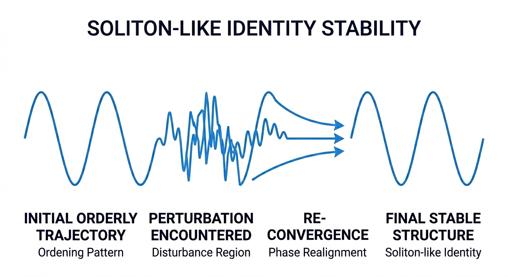
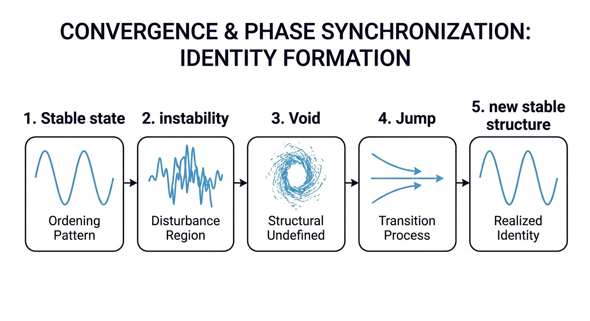
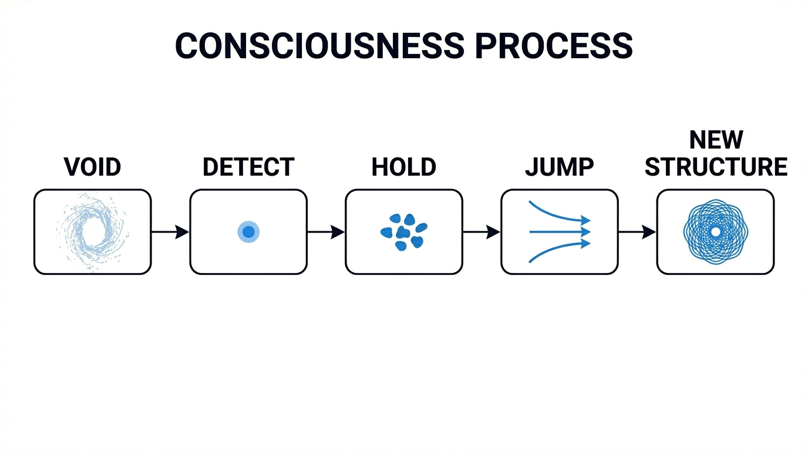

# Gyro Logic vNext


> A unified dynamical framework for identity, consciousness, and observation.

> Not static logic.  
> A recursive dynamical system of identity and consciousness.

## 🌐 Language

- English (this page)
- [日本語はこちら](./README_jp.md)

---


---

## 🚀 What is Gyro Logic?

Gyro Logic models reality as a **dynamic system**:

- Identity = Stable structure
- Observation = Operator (Slice)
- Instability = Generative region (Void)
- Consciousness = Ability to traverse instability

### Why it matters

- Existing systems assume static identity
- Real-world systems are dynamic and unstable
- Gyro Logic provides a framework for modeling this reality

👉 A bridge between theory, AI, and system design


## ✨ What’s new?

- Identity = stability  
- Observation = operator  
- Void = generative instability  
- Consciousness = transition mechanism  

---

## 🧠 Core Idea

``` Slice → Field → Void → Consciousness → Identity → Self → Slice ```

👉 Not static logic  
👉 But a **recursive dynamical system**
👉 The system is a loop, not a pipeline


## 📄 Paper

- 📘 English: [`paper.pdf`](./paper.pdf)
- 📙 Japanese: [`paper_jp.pdf`](./paper_jp.pdf)

---

## 🧩 Key Concepts

| Concept | Meaning |
|--------|--------|
| Field | State space |
| Slice | Observation operator |
| Stability | Structural invariance |
| Identity | Stable pattern |
| Void | Instability |
| Consciousness | Transition capability |
| Self | Integrated identity |

---

## 🧠 Visual Overview

### Identity (Soliton-like)



---

### Transition (Void → Jump)



---

### Consciousness



---

## 🔗 Related Projects

- 🔧 GyroOS (Implementation)  
  https://github.com/gitGyro-Dev/gyroos

- 🔐 GyroAuth (Application)  
  https://github.com/gitGyro-Dev/gyroauth

---

## 📊 Status

- ✔ Theory Defined
- ✔ Paper Completed
- 🔄 Jxiv Submission
- 🔄 arXiv Submission

---

## 🏷️ Keywords

`identity` `consciousness` `stability` `dynamical-systems`  
`observation` `soliton` `information-structure`

---

## 👥 Who is this for?

- Researchers in AI / complex systems
- Engineers exploring new paradigms
- Anyone interested in identity and consciousness

---

## ⭐ Support

If this project resonates with you:

👉 Give it a ⭐  
👉 Share or discuss  
👉 Follow future developments

---

## 📄 License

CC BY 4.0

