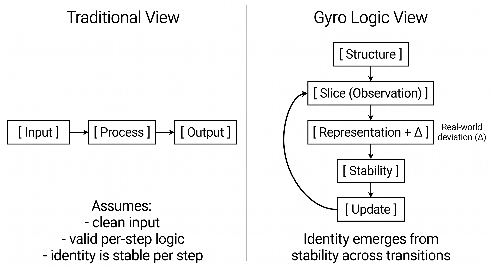
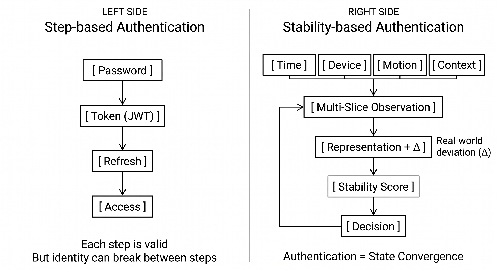

# Gyro Logic

**A Stability-Based Framework for Representation Under Intrinsic Deviation**

---

## What is Gyro Logic?

Gyro Logic is a theoretical framework for modeling representation, meaning, and identity through the relation between **Structure**, **Slice**, and **Stability**.

At its core, Gyro Logic defines the following invariant structure:

```text
Structure → Slice → Stability
```

This core principle is not replaced by later extensions.
Loop, Operator, Orientation, Response, Deviation, Void, and Jump are defined as auxiliary concepts that extend or unfold this principle without changing it.

---

## Core Principle

```text
Structure → Slice → Stability
```

- **Structure** is an undifferentiated or multidimensional relational structure.
- **Slice** is the act-concept by which Structure appears under a certain perspective, angle, granularity, or context.
- **Stability** is the state quantity that appears in the result of Slice.

Stability is not an evaluator.
It is not the agent that decides, judges, or controls the next step.

```text
Stability is evaluated.
Stability does not evaluate.
```

---

## Gyro Unit

A **Gyro Unit** is the minimal time-free theoretical unit of Gyro Logic.

```text
Gyro Unit
= Structure → Slice → Stability
```

In Gyro Unit, the arrow does not primarily indicate physical time.
It indicates logical dependency or relational constitution.

Temporal processes such as execution, computation, response, continuation, stopping, and jump do not belong to Gyro Unit itself.
They belong to Gyro Process or Gyro Loop.

---

## Gyro Process

A **Gyro Process** is the time-including operational unfolding of Gyro Unit.

```text
Structure
→ Operator Orientation
→ slice-ing
→ slice-done
→ Stability
→ Operator Response
```

Gyro Process is a single operational cycle.
It is not yet a loop.

Time appears mainly in:

```text
slice-ing
Operator Response
```

---

## Gyro Loop

A **Gyro Loop** is the iterative structure formed when Gyro Processes are connected through Operator Response.

```text
Gyro Process_n
→ Operator Response_n
→ Next Structure / Next Slice / Stop / Continue / Jump
→ Gyro Process_n+1
```

Gyro Loop does not replace the core principle:

```text
Structure → Slice → Stability
```

Rather, Gyro Loop is the iterative extension of Gyro Process.

---

## Slice, slice-ing, and slice-done

Gyro Logic distinguishes between three layers of Slice.

```text
Slice
= the general act-concept by which Structure appears
```

```text
slice-ing
= the time-including act-process in which Slice is being performed
```

```text
slice-done
= the completed result of Slice
```

Stability appears in slice-done.

```text
slice-done = X + Δ
```

where:

- **X** is the representation produced by Slice.
- **Δ** is the deviation between Structure and Representation.

The time required for computation, observation, search, or transformation belongs to **slice-ing**, not to the logical result itself.

---

## Stability

Gyro Logic distinguishes between two layers of Stability.

```text
Stability as property
= the state quantity that appears in a single slice-done
```

```text
Stability over time
= the persistence, variation, or trajectory of Stability across multiple Gyro Processes
```

In a single Gyro Unit:

```text
σ = Stab(X, Δ)
```

In a Gyro Loop:

```text
{σ_n}
```

Stability remains a state quantity.
It does not decide the next Slice, Structure, continuation, stopping, or Jump.
The next action is determined by **Operator Response**.

High Stability may indicate robustness, but excessive Stability may also indicate rigidity.

---

## Operator Orientation and Operator Response

Gyro Logic distinguishes between the pre-slice and post-stability roles of the Operator.

```text
Operator Orientation
= the pre-slice directional condition by which an operator orients how Structure is sliced
```

```text
Operator Response
= the post-stability reaction by which an operator determines whether to continue, stop, adjust Slice, update Orientation, update Structure, or Jump
```

Their temporal positions are:

```text
Structure
→ Operator Orientation
→ slice-ing
→ slice-done
→ Stability
→ Operator Response
→ Next
```

Operator Orientation is not Slice itself.
Operator Response is not Stability itself.

---

## Time Structure

Gyro Logic separates time-free relational structure from time-including operational process.

```text
Gyro Unit
= time-free relational structure
```

```text
Gyro Process
= time-including operational cycle
```

```text
Gyro Loop
= time-including iterative structure
```

In one sentence:

```text
Gyro Logic defines its core structure as time-free, while time appears in Gyro Loop through slice-ing and Operator Response.
```

---

## Deviation, Void, and Jump

### Deviation

```text
Δ = deviation between Structure and Representation
```

A completed Slice may be represented as:

```text
slice-done = X + Δ
```

### Void

Void is the region where Stability is undefined, too low, or cannot be meaningfully evaluated.

### Jump

Jump is a non-continuous reconstruction selected when existing Orientation, Slice, or Structure cannot resolve the current deviation or void.

```text
Void / large Δ / unstable Stability
→ Operator Response
→ Jump
```

Void does not jump by itself.
Jump is selected through Operator Response.

---

## Minimal Model

Time-free Gyro Unit:

```text
X + Δ = O(S)
σ = Stab(X, Δ)
```

Time-including Gyro Process:

```text
S(t0)
→ B(t0)
→ slice-ing(t0〜t1)
→ X(t1) + Δ(t1)
→ σ(t1)
→ R(t1〜t2)
```

Gyro Loop:

```text
P_n = (S_n, B_n, O_n, X_n, Δ_n, σ_n, R_n)
P_{n+1} = L(P_n)
```

where the next state is selected through Operator Response, not by Stability itself.

---

## Layered Architecture

Gyro Logic is the theoretical layer.

```text
Gyro Logic
↓
GyroOS
↓
GyroAuth
```

- **Gyro Logic**: theory layer
- **GyroOS**: implementation layer
- **GyroAuth**: application layer

Implementation concerns from GyroOS must not redefine Gyro Logic.
Application concerns from GyroAuth must not be mixed into the theory layer.

---

## GyroAuth

GyroAuth is an application layer built from Gyro Logic through GyroOS.

In GyroAuth:

- Authentication = State Convergence
- Identity = Stable Trajectory

GyroAuth is not the definition of Gyro Logic.
It is one application of the theory.

---

## Current Focus

This release clarifies the theoretical distinction between:

- Gyro Unit
- Gyro Process
- Gyro Loop
- Slice / slice-ing / slice-done
- Stability as property / Stability over time
- Operator Orientation / Operator Response
- Deviation / Void / Jump

The purpose is to preserve the core principle:

```text
Structure → Slice → Stability
```

while making the temporal and iterative extensions explicit.

---

## Figures





---

## Paper / Archive

Gyro Logic v2.6 introduced the Loop and dynamical-system direction.
This version clarifies the theoretical structure of Unit, Process, Loop, Slice, Stability, and Operator.

Reference archive:
https://doi.org/10.5281/zenodo.19674468

---

## Repository Structure

```text
/docs
/figures
/paper
```

---

## Minimal Summary

```text
Gyro Logic begins with a time-free Gyro Unit:
Structure → Slice → Stability

It unfolds into a time-including Gyro Process:
Structure → Operator Orientation → slice-ing → slice-done → Stability → Operator Response

It becomes a Gyro Loop when Processes are iteratively connected through Operator Response.
```

---

## License

CC-BY-4.0
