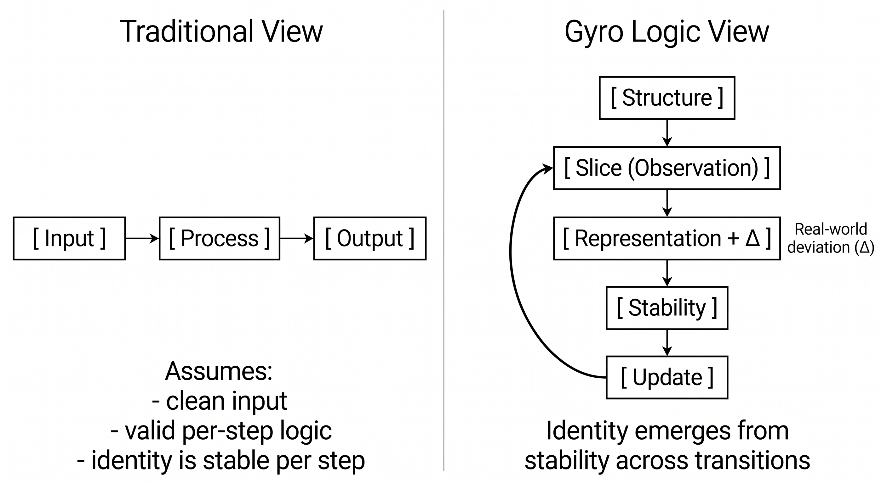
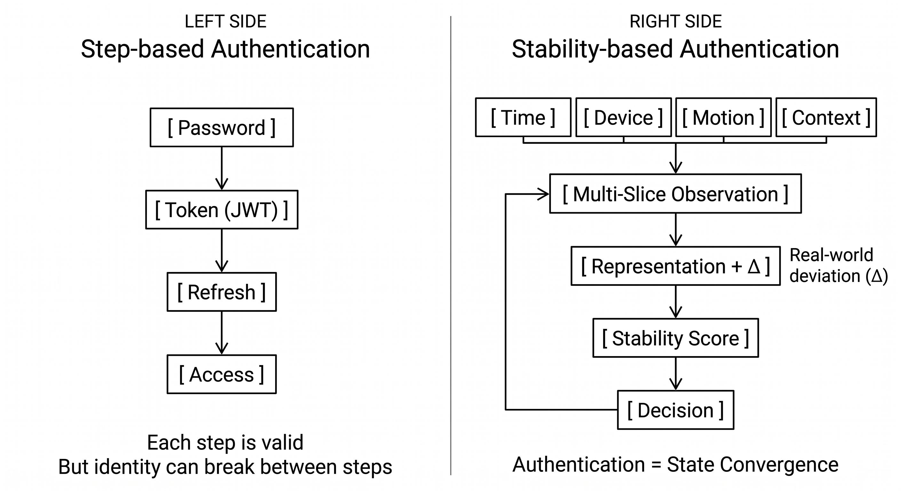

# Gyro Logic

**内在的ズレにおける表現のための安定性ベース理論**

---

## Gyro Logicとは

Gyro Logic は、**Structure**、**Slice**、**Stability** の関係によって、表現・意味・同一性を扱う理論的フレームワークです。

中核原理は、次の不変構造です。

```text
Structure → Slice → Stability
```

この中核原理は、後続の拡張概念によって置き換えられません。
Loop、Operator、Orientation、Response、Deviation、Void、Jump、Trajectory、Context、Boundary、Boundary State は、すべてこの原理を補助・展開・解釈する概念であり、原理そのものを変更するものではありません。

精緻化された Core 定義は、次の文書で管理します。

```text
docs/01_Core_Definitions.md
```

---

## 中核原理

```text
Structure → Slice → Stability
```

- **Structure** は、何かが成立し得る様式です。
- **Slice** は、Structure の中に一つの成立へ向かう道筋が開かれる過程です。
- **Stability** は、開かれた道筋が一つの成立として現れ、そのまま継続可能な状態です。

Structure は、固定された物体、入力、状態、集合、器のいずれかだけに限定されません。それまでの変遷を保持しながら、次の Slice が始まり得る状態として成立する場合があります。

Slice は、物理的または論理的な切断だけに限定されません。対象や関係を局所化しながら、Difference、Boundary、Context などが読めるようになる道筋を開きます。

Stability は、静止、停止、最終的な終了ではありません。成立した状態が、その後の Structure や Slice へ接続可能であることを含みます。

```text
Structure → Slice → Stability
```

は、始まり・途中・終わりという静的な三段階を表すものではありません。
それは、継続する Trajectory の中で、一つの成立がどのように現れるかを示します。

Stability は評価者ではありません。
次の段階を判断したり、制御したりする主体ではありません。

```text
Stabilityは評価される。
Stabilityは評価しない。
```

---

## Gyro Unit

**Gyro Unit** は、Gyro Logic における時間なしの最小理論単位です。

```text
Gyro Unit
= Structure → Slice → Stability
```

Gyro Unit における矢印は、主として物理時間の流れを表すものではありません。
それは、論理的依存関係または関係的成立を表します。

時間なしの定式化は、Core が閉じた始点から終点までの列を表すという意味ではありません。継続する Trajectory の中で、一つの成立が現れる関係的構成を切り出しているという意味です。

実行、計算、反応、継続、停止、Jump などの時間過程は、Gyro Unit そのものには属しません。
それらは Gyro Process または Gyro Loop に属します。

---

## Gyro Process

**Gyro Process** は、Gyro Unit を時間ありの作用過程として展開したものです。

```text
Structure
→ Operator Orientation
→ slice-ing
→ slice-done
→ Stability
→ Operator Response
```

Gyro Process は、一回分の作用周期です。
まだ Loop そのものではありません。

時間は主に次の部分に現れます。

```text
slice-ing
Operator Response
```

---

## Gyro Loop

**Gyro Loop** は、Gyro Process が Operator Response によって接続されることで成立する反復構造です。

```text
Gyro Process_n
→ Operator Response_n
→ Next Structure / Next Slice / Stop / Continue / Jump
→ Gyro Process_n+1
```

Gyro Loop は、中核原理を置き換えません。

```text
Structure → Slice → Stability
```

Gyro Loop は、Gyro Process の反復的拡張であり、継続する Flow の中で局所的に繰り返し現れる成立構造として理解できます。

---

## Slice / slice-ing / slice-done

Gyro Logic では、Slice の内部を三つの読み方に分けて扱います。

```text
Slice
= Structureの中に、一つの成立へ向かう道筋が開かれる過程全体
```

```text
slice-ing
= その道筋が開かれている時間ありの作用過程
```

```text
slice-done
= Difference、Boundary、Contextなどが、Sliceの結果として読める状態になった段階
```

Operator Orientation は Slice への方向づけを与えますが、Operator 自体を Core に追加するものではありません。
Orientation、slice-ing、slice-done は Slice の内部的または作用的な読み分けであり、新しい Core 要素ではありません。

Stability は slice-done に現れます。

```text
slice-done = X + Δ
```

ここで：

- **X** は、Slice によって現れた Representation です。
- **Δ** は、Structure と Representation のズレです。

計算、観測、探索、認識、変換に必要な時間は、論理結果そのものではなく **slice-ing** に属します。
途中状態は「半分成立した理解」ではなく、対象となる関係が slice-done として読めるようになるまでは slice-ing のままです。

---

## Stability

Gyro Logic では、Stability を二層に分けて扱います。

```text
Stability as property
= 単一のslice-doneに現れる状態量
```

```text
Stability over time
= 複数のGyro Processをまたいで現れるStabilityの持続・変化・軌跡
```

単一の Gyro Unit では：

```text
σ = Stab(X, Δ)
```

Gyro Loop では：

```text
{σ_n}
```

Stability は状態量であり続けます。
次の Slice、Structure、継続、停止、Jump を決めるものではありません。
次の作用を決めるのは **Operator Response** です。

Stability は、次のように読むことができます。

```text
開かれた道筋が一つの成立として読めるようになり、
その成立が継続可能な状態にある。
```

高い Stability は頑健性を意味する場合があります。
しかし、過剰な Stability は硬直化を意味する場合もあります。

---

## Operator Orientation と Operator Response

Gyro Logic では、Operator の Slice 前の役割と Stability 後の役割を区別します。

```text
Operator Orientation
= Structureの中で、あるSliceの道筋が開き始める方向的条件または契機
```

```text
Operator Response
= 継続、停止、Slice調整、Orientation更新、Structure更新、Jumpを決めるStability後の反応
```

時間的位置は次です。

```text
Structure
→ Operator Orientation
→ slice-ing
→ slice-done
→ Stability
→ Operator Response
→ Next
```

Operator Orientation は新しい Core 要素ではありません。
作用過程として見た Slice の方向的入口または内部的始まりとして扱います。
Operator Response は Stability そのものではありません。

---

## 時間構造

Gyro Logic は、時間なしの関係構造と、時間ありの作用過程を分けます。

```text
Gyro Unit
= 時間なしの関係構造
```

```text
Gyro Process
= 時間ありの作用周期
```

```text
Gyro Loop
= 時間ありの反復構造
```

Trajectory は、Structure、Slice、Stability より上位に置かれる新しい Core ではありません。
それは、Core が変化と継続の中でどのように現れるかを時間方向から読んだ姿です。

一文で言えば：

```text
Gyro LogicはCoreを時間なしの関係的構成として定義し、作用過程として展開するとき、時間はslice-ing、Operator Response、Process、Loop、Trajectoryに現れる。
```

---

## Deviation / Void / Jump

### Deviation

```text
Δ = StructureとRepresentationのズレ
```

完了した Slice は、次のように表せます。

```text
slice-done = X + Δ
```

### Void

Void は、現在の Slice 条件では成立させること、読むこと、接続すること、または意味のある評価を行うことができない領域です。
Void は絶対的な無ではなく、読める Absence とも区別されます。

### Jump

Jump は、既存の Orientation、Slice、Structure では現在のズレや Void を解消できないときに選ばれる非連続的な再構成です。

```text
Void / large Δ / unstable Stability
→ Operator Response
→ Jump
```

Void が自ら Jump するわけではありません。
Jump は Operator Response によって選ばれます。

---

## Boundary Extension

Boundary と Boundary State は、Slice によって区別がどのように読めるものになるかを説明する補助概念です。

これらは中核原理を置き換えません。

```text
Structure → Slice → Stability
```

```text
Boundary = Slice 相対的に読める区別
Boundary State = Boundary に対する暫定的関係状態
```

Boundary は、Structure に固定的に存在する線ではありません。  
Boundary は、Operator Orientation と Context に基づく Slice によって、生成・顕在化・安定化される区別です。

精緻化された Core 解釈では、Difference は Slice によって読めるようになり、その Difference が成立した区別として扱えるとき、Boundary が現れる可能性があります。
したがって、Boundary は Difference の原因ではなく、新しい Core 要素でもありません。

Boundary State は、その Boundary に対して、対象が現在どのような関係状態として位置づくかを示します。

詳細ノート：

```text
docs/15_Boundary_20260610.md
docs/16_Boundary_State_20260610.md
```

---

## 最小モデル

時間なしの Gyro Unit：

```text
X + Δ = O(S)
σ = Stab(X, Δ)
```

時間ありの Gyro Process：

```text
S(t0)
→ B(t0)
→ slice-ing(t0〜t1)
→ X(t1) + Δ(t1)
→ σ(t1)
→ R(t1〜t2)
```

Gyro Loop：

```text
P_n = (S_n, B_n, O_n, X_n, Δ_n, σ_n, R_n)
P_{n+1} = L(P_n)
```

次状態は Stability 自体ではなく、Operator Response によって選ばれます。

---

## レイヤー構造

Gyro Logic は理論層です。

```text
Gyro Logic
↓
GyroOS
↓
GyroAuth
```

- **Gyro Logic**：理論層
- **GyroOS**：実装層
- **GyroAuth**：応用層

GyroOS の実装都合によって Gyro Logic を再定義してはいけません。
GyroAuth の応用仕様を理論層に混ぜてはいけません。

---

## GyroAuth

GyroAuth は、Gyro Logic を GyroOS を通じて応用したアプリケーション層です。

GyroAuth では：

- Authentication = State Convergence
- Identity = Stable Trajectory

GyroAuth は Gyro Logic の定義ではありません。
それは理論の一つの応用です。

---

## 現在の焦点

現在の理論精緻化では、次を明確化します。

- Structure を「何かが成立し得る様式」として読むこと
- Slice を「Structure の中に道筋が開かれる過程」として読むこと
- Stability を「終了ではなく継続可能な成立」として読むこと
- Gyro Unit / Gyro Process / Gyro Loop
- Slice / slice-ing / slice-done
- Stability as property / Stability over time
- Operator Orientation / Operator Response
- Trajectory を Core の時間方向の読み方として扱うこと
- Deviation / Void / Jump
- Boundary / Boundary State

目的は、中核原理である次を保持することです。

```text
Structure → Slice → Stability
```

そのうえで、Trajectory、Flow、Process、Loop、Boundary に関する拡張の中で、成立がどのように現れ、継続するかを明確にします。

---

## Figures





---

## Paper / Archive

Gyro Logic v2.6 では、Loop と Dynamical System 方向を導入しました。
Gyro Logic v3.0 では、Boundary Extension を導入しました。
現在の精緻化では、不変の Core を変更せず、Structure、Slice、Stability の定義を深めています。

Reference archive:
https://doi.org/10.5281/zenodo.19674468

---

## Repository Structure

```text
/docs
/figures
/paper
```

Core 定義の基準文書：

```text
docs/01_Core_Definitions.md
```

---

## Minimal Summary

```text
Gyro Logicは、時間なしのGyro Unitから始まる：
Structure → Slice → Stability

Structureは、何かが成立し得る様式である。
Sliceは、Structureの中に一つの成立へ向かう道筋が開かれる過程である。
Stabilityは、その道筋が一つの成立として現れ、そのまま継続可能な状態である。

Coreは、始まり・途中・終わりという静的な三段階ではない。
継続するTrajectoryの中で、一つの成立がどのように現れるかを示す。

それは時間ありのGyro Processとして展開される：
Structure → Operator Orientation → slice-ing → slice-done → Stability → Operator Response

ProcessがOperator Responseによって反復接続されると、Gyro Loopになる。

BoundaryはSlice相対的に読める区別である。
Boundary StateはBoundaryに対する対象の暫定的関係状態である。
```

---

## License

CC-BY-4.0
