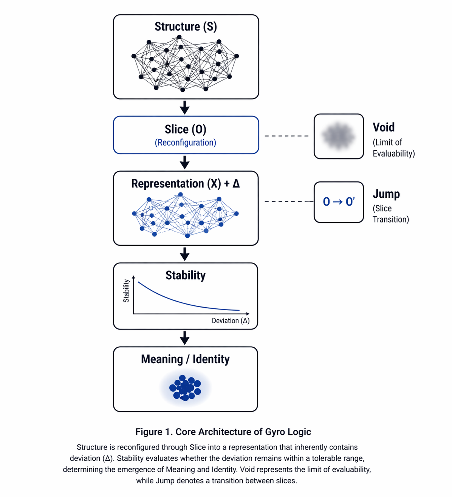
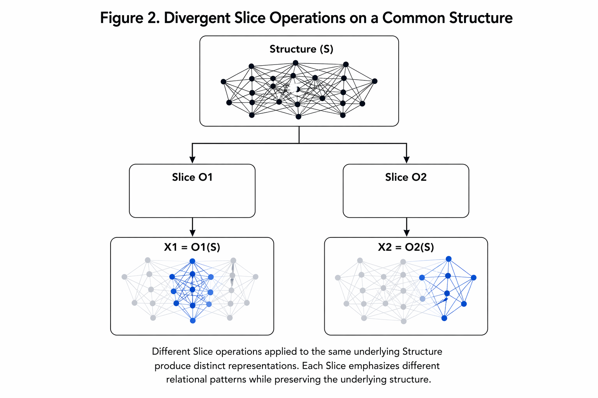
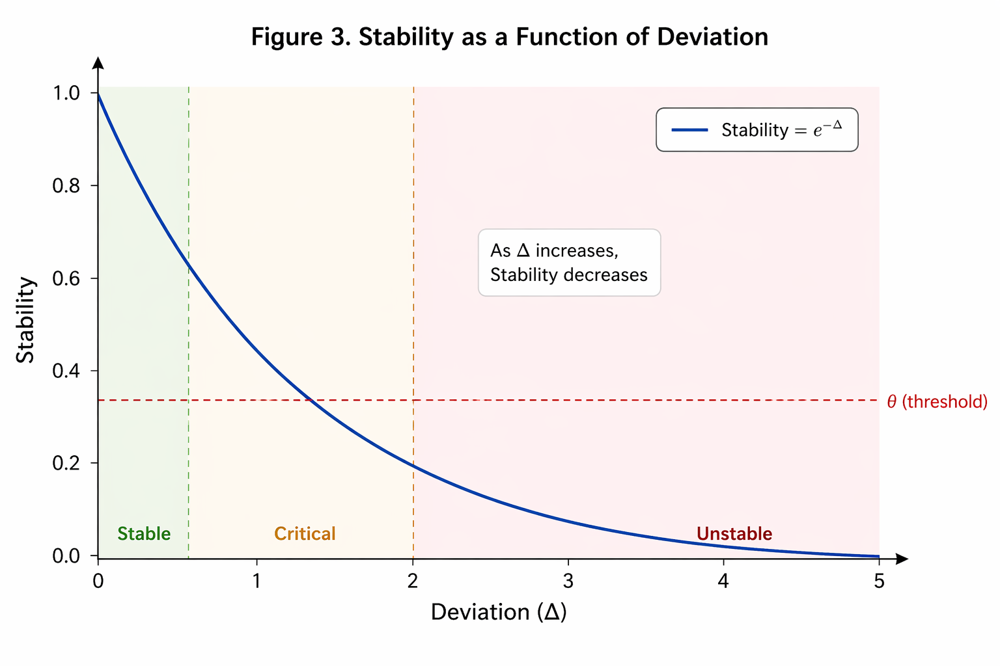
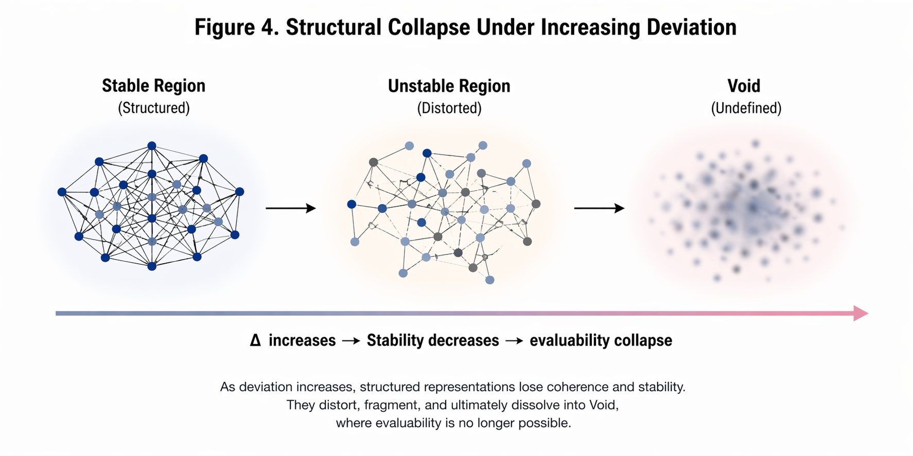
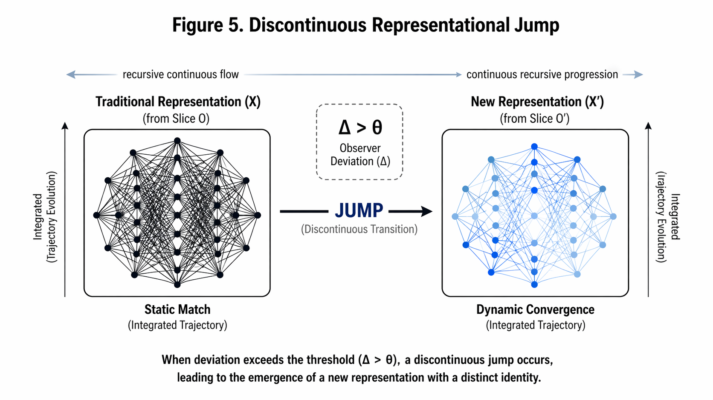
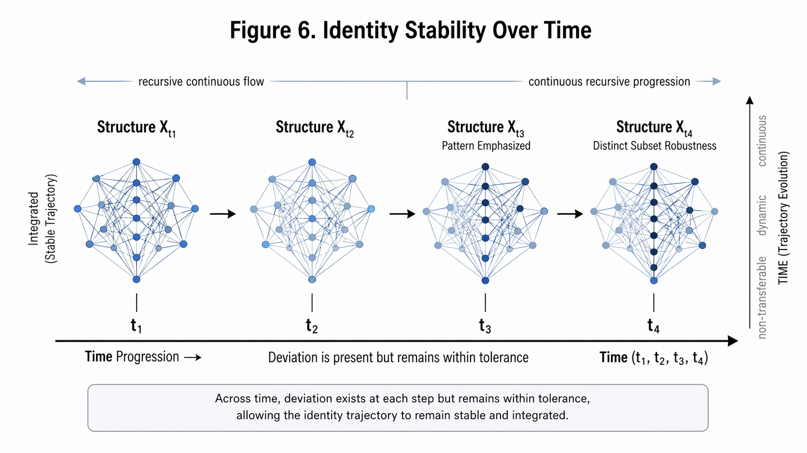

# Gyro Logic: A Stability-Based Framework for Representation Under Intrinsic Deviation

---

## Abstract

Gyro Logic is a theoretical framework that models reality not as a direct reflection of an underlying structure, but as a reconfigured representation generated through observation. In this framework, observation is formalized as a Slice operation that transforms a latent Structure into a representation. Crucially, every Slice inherently introduces deviation ($\Delta$), which is not treated as noise or error, but as an intrinsic component of representation.

Stability is defined as a functional of deviation, measuring the extent to which representations remain consistent across multiple observational transformations. Meaning, identity, and reference are then derived as stable structures that persist under controlled deviation. When deviation exceeds a critical threshold, the current Slice collapses, leading to a discontinuous transition (Jump) into a new representational regime. Furthermore, regions where deviation becomes undefined or unbounded are characterized as Void, representing the limit of evaluability.

---

## 1. Introduction

Gyro Logic proposes that reality is not directly observed, but constructed through observation.

The framework is built on three core elements:

- Structure $S$
- Slice $O$
- Stability

---

## 2. Core Architecture

$$
X = O(S)
$$

---

## 3. Slice-Dependent Representation

$$
X_1 = O_1(S), \quad X_2 = O_2(S)
$$

---

## 4. Stability as a Function of Deviation

Let the structure space be $\mathcal{S}$ and the representation space be $\mathcal{X}$.

$$
O : \mathcal{S} \to \mathcal{X}
$$

Define a metric:

$$
d : \mathcal{X} \times \mathcal{X} \to \mathbb{R}_{\ge 0}
$$

Deviation:

$$
\Delta(S) :=
\mathbb{E}_{O_1,O_2} \left[
d\big(O_1(S), O_2(S)\big)
\right]
$$

Stability:

$$
\mathrm{Stability}(S) :=
\exp(-\lambda \Delta(S)), \quad \lambda > 0
$$

---

## 5. Collapse into Void

$$
\mathrm{Void} :=
\{ X \mid \Delta(X)\ \mathrm{undefined\ or\ diverges} \}
$$

---

## 6. Discontinuous Transition (Jump)

$$
\Delta > \theta \Rightarrow O \to O'
$$

---

## 7. Identity as Stable Trajectory

$$
\gamma : [0,T] \to \mathcal{X}
$$

$$
\mathcal{I}_\theta :=
\{ \gamma \mid \mathrm{Stability}(\gamma(t)) \ge \theta \}
$$

---

## 8. Conclusion

Gyro Logic provides a unified framework for representation, deviation, and stability.

---

# Appendix A. Formal Definitions

$$
O : \mathcal{S} \to \mathcal{X}
$$

$$
X = O(S)
$$

$$
\Delta(S) :=
\mathbb{E}_{O_1,O_2}
\left[
d\big(O_1(S), O_2(S)\big)
\right]
$$

$$
\mathrm{Stability}(S) :=
\exp(-\lambda \Delta(S))
$$

$$
\mathcal{M}_\theta :=
\{ X \mid \mathrm{Stability}(X) \ge \theta \}
$$

$$
\mathrm{Void} :=
\{ X \mid \Delta(X)\ \mathrm{undefined\ or\ diverges} \}
$$

$$
\mathcal{I}_\theta :=
\{ \gamma \mid \mathrm{Stability}(\gamma(t)) \ge \theta \}
$$

---

# Appendix B. Theoretical Results

$$
0 < \mathrm{Stability}(S) \le 1
$$

$$
\Delta_1 < \Delta_2 \Rightarrow \mathrm{Stability}_1 > \mathrm{Stability}_2
$$

$$
X \in \mathcal{M}_\theta \iff \mathrm{Stability}(X) \ge \theta
$$

$$
\Delta(X) \to \infty \Rightarrow \mathrm{Stability}(X) \to 0
$$