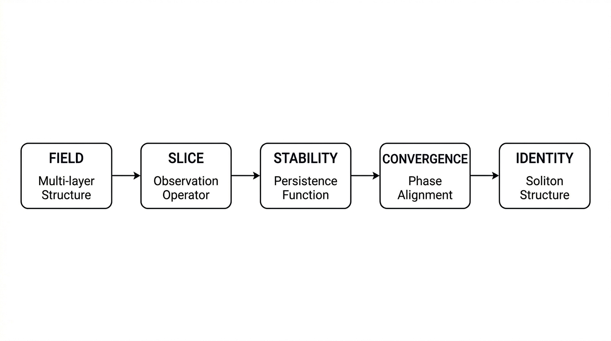
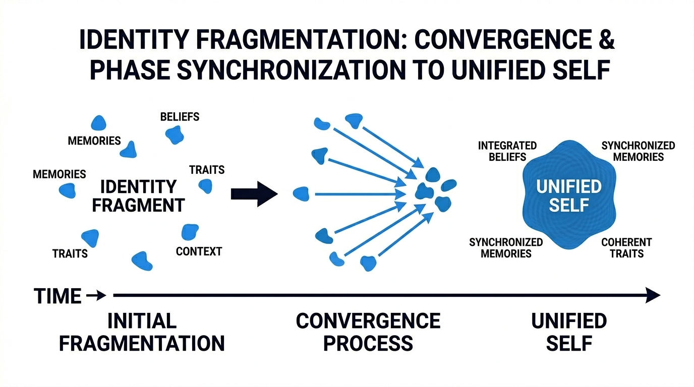

# Abstract

We propose Gyro Logic vNext, a unified dynamical framework that models identity, consciousness, and observation as interacting processes within a dynamically evolving system.

Reality is represented as a dynamic Field, observation as an adaptive operator (Slice), identity as a preserved dynamic structure, and consciousness as the capacity to detect and traverse Void within a dynamically evolving system.

We introduce a coupled system governing Field, Slice, Void, Consciousness, Identity, and Self, unifying epistemology, ontology, and information dynamics.

---

# 1. Introduction

Classical logic assumes static identity and passive observation.  
However, real systems exhibit dynamic identity, observer-dependent structure, and instability-driven transformation.

Gyro Logic vNext proposes:

- Identity as stability  
- Observation as operator  
- Void as generative instability  
- Consciousness as structural transition capacity  

---

**Figure 1:** Fundamental flow of Gyro Logic. Stability emerges from repeated application of Slice over Field, giving rise to Identity.

---

# 2. Preliminaries

## Field

$$
F(t) \in \mathcal{F}
$$

## Slice

$$
S(t): \mathcal{F} \to \mathcal{F}
$$

## Stability Functional

$$
\mathrm{Stab}(F; S) = - \| S(F) - F \|^2
$$

A structure is stable when:

$$
S(F) \approx F
$$

## Identity

$$
I = \{ F \mid S(F) = F \}
$$

## Convergence

$$
\lim_{n \to \infty} S^n(F) = F^*
$$

## Void

$$
V(t) = 1 - \mathrm{Stab}(F(t); S(t))
$$

---

# 3. Core Structures

## Identity Dynamics

$$
I(t+1) = I(t) + G_{id} - L_{id} + N_{id}
$$

---

**Figure 2:** Identity behaves as a soliton-like structure, maintaining stability under perturbations and re-converging over time.

---

## Self Dynamics

$$
\mathrm{Self}(t+1) =
\alpha \mathrm{Self}(t)
+ \beta W(t) \cdot I(t)
+ \eta M(t)
+ \kappa H(t)
+ \gamma J(t)
- \delta L(t)
$$

---

## Consciousness

$$
C(t) = (D(t), H(t), J(t))
$$

---

# 4. Void Dynamics

$$
V(t+1) = V(t)
       + a I_{\text{inst}}
       + p L_{id}
       + q L_{\text{self}}
       - b R_{id}
       - c J_{\text{eff}}
       + d E
$$

---

# 5. Slice Evolution

Self(t+1) = defined in Section 3  
S(t+1) = defined in Section 5

---

**Figure 3:** Structural transition through instability. As stability collapses, Void expands, enabling a Jump into a new stable configuration.

---

# 6. Unified Dynamical System

Self(t+1) = defined in Section 3  
S(t+1) = defined in Section 5

---

**Figure 4:** Closed-loop structure of the Gyro Logic system. Observation, 
instability, identity, and self form a recursive dynamical loop.

---

# 7. Consciousness Process

Consciousness is defined as the ability to detect, maintain, and resolve Void through structural transition.

---

**Figure 5:** Consciousness as a process: detection of instability (Void), sustained holding, and generation of a structural transition (Jump).

---

# 8. Self Integration

Self is formed by integrating multiple identity structures across time.

---

**Figure 6:** Integration of identity fragments into a unified Self, with continuous reconstruction under dynamic conditions.

---

# 9. Theoretical Results

**Theorem 1 (Identity Emergence):**  
Identity emerges only through traversal of Void followed by Jump.

**Theorem 2 (Consciousness Condition):**  
A system is conscious if and only if it can detect, maintain, and resolve Void.

**Theorem 3 (Synchronization Impossibility):**  
Complete synchronization is impossible across systems with different Slice operators.

**Theorem 4 (Collapse Condition):**  
Collapse occurs when Void exceeds reconstruction capacity over time.

---

# 10. Philosophical Integration

**Definition (Truth):**  
Truth is a slice-dependent invariant projection.

**Definition (Creativity):**  
Creativity is emergence after Void traversal.

**Definition (Ethics):**  
Ethics is evaluation over multi-scale stability.

**Definition (Free Will):**  
Free will is the capacity to update Slice operators.

**Definition (Qualia):**  
Qualia are structures accessible only through a first-person Slice.

---

# 11. GyroOS Mapping

Field → State engine  
Slice → Observation API  
Void → anomaly layer  
Identity → pattern detector  
Self → integration module  
Consciousness → control engine  

---

# 12. GyroAuth Connection

Authentication = convergence  
Identity = soliton-like trajectory  
Attack = pseudo-soliton  

---

# 13. Discussion

Static systems fail to represent:

- dynamic identity  
- observation-dependent structure  
- instability-driven change  

Multi-dimensional representation is required.

---

# 14. Conclusion

Gyro Logic vNext provides a unified dynamical model for identity, consciousness, and observation.

It connects theory, computation, and application into a single framework.