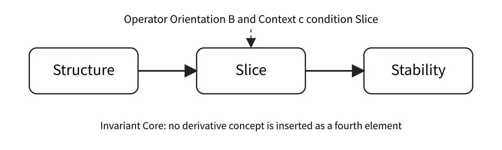
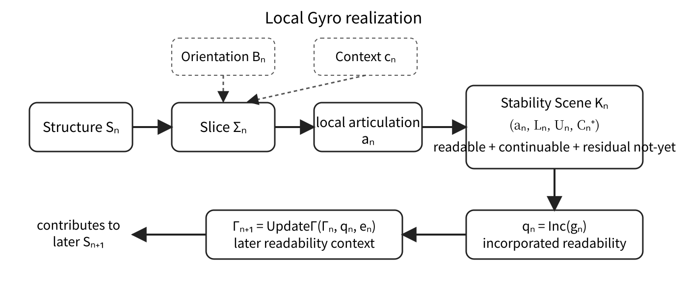
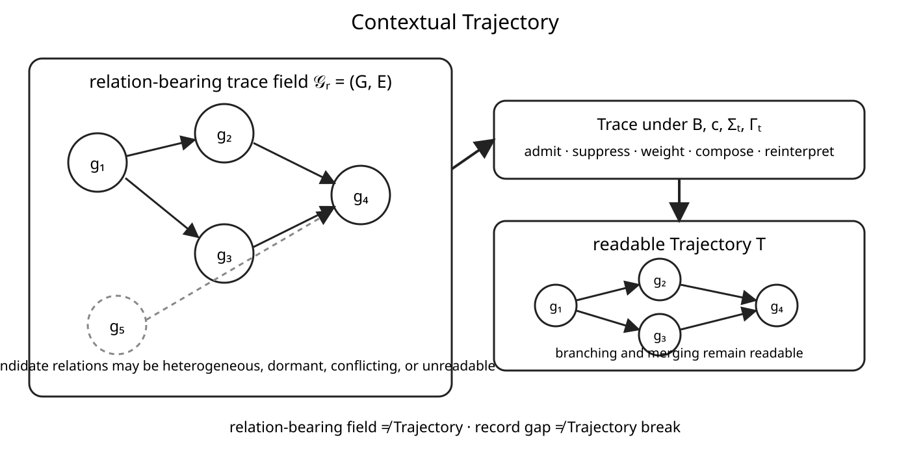

**Author:** Shuntaro Kawakami  
**Affiliation:** Independent Researcher  
**ORCID:** [0009-0004-0091-1303](https://orcid.org/0009-0004-0091-1303)  
**Correspondence:** [dev.jxiv@gyro-wedge.com](mailto:dev.jxiv@gyro-wedge.com)

# Abstract

Gyro Logic is a theoretical framework organized around the invariant Core of Structure, Slice, and Stability. An earlier introductory paper established the conceptual role of this Core and addressed the foundational question of what Gyro Logic is. The present paper addresses a distinct formalization problem: how the current conceptual distinctions of Gyro Logic can be organized into a minimal formal model without replacing the canonical definitions or prematurely reducing the framework to a single established mathematical discipline.

The proposed model begins by preserving the canonical Core while separating the Slice process from the local articulation that becomes available through it. A local Gyro realization is provisionally represented as

\[
g_n=(S_n,B_n,c_n,\Sigma_n,a_n,K_n),
\]

where \(S_n\) is Structure, \(B_n\) is Operator Orientation, \(c_n\) is Context, \(\Sigma_n\) is the Slice process, \(a_n\) is the resulting local articulation, and \(K_n\) is the corresponding Stability Scene. The central Core relation is expressed as

\[
S_n\xRightarrow{\Sigma_{B_n,c_n}}a_n\xRightarrow{\operatorname{Stab}}K_n.
\]

Stability is not reduced to a scalar, equilibrium, fixed point, or terminal condition. It is modeled as a structured local scene in which an articulation becomes readable as an establishment that can continue while residual local not-yet may remain. Incorporated Readability is distinguished from stored history and represented as a context update through which locally established distinctions, relations, criteria, and relevance conditions become available to later realizations. Continuity Readability is separated from Identity, and Trajectory is separated from both state sequences and chronological logs by treating it as contextual tracing over admissible relations among local Gyro realizations. Difference is likewise separated from metric distance, numerical error, and Boundary, and is provisionally typed as a Slice-, Orientation-, and Context-relative structured relation with a potentially heterogeneous codomain.

The paper compares the resulting schema with relational structures, graphs and hypergraphs, order theory, topology, dynamical systems, transition systems, event structures, category theory, logic and proof theory, constraint propagation, probability and statistics, sheaf-like structures, and process algebra. These comparisons show that each field can supply useful partial models, but that no single one currently preserves all Gyro-specific distinctions without introducing stronger assumptions.

The resulting Minimal Formal Model is exploratory rather than canonical. It does not provide a complete axiomatization, a universal semantics of readability, a universal Stability metric, or a general tracing algorithm. Its contribution is to identify the minimum formal commitments needed to preserve the current distinctions among Structure, Slice, local articulation, Stability, Incorporated Readability, Continuity Readability, Trajectory, Difference, and Boundary, thereby providing a basis for subsequent validation, comparison, and implementation studies.

**Keywords:** Gyro Logic; minimal formal model; Structure; Slice; Stability; local articulation; Incorporated Readability; Continuity Readability; contextual Trajectory; Difference; Boundary

# 1 Introduction

Gyro Logic is a theoretical framework organized around the invariant Core:

```text
Structure
↓
Slice
↓
Stability
```

The introductory Gyro Logic paper established the conceptual role of this Core and presented the framework as a way to describe how an establishment becomes available through Structure, Slice, and Stability. That foundational account primarily addressed the question of what Gyro Logic is. The present paper addresses a different problem: how the current theoretical distinctions can be given a minimal formal organization without replacing the canonical definitions or reducing the framework prematurely to a single established mathematical discipline.

This problem arises because familiar mathematical formalisms often begin from commitments that are stronger than those currently required by Gyro Logic. A state-space model normally assumes that states and their space are specified in advance. A function assumes an identifiable domain and codomain. A graph assumes that nodes and edges can already be represented. A dynamical trajectory is typically expressed as an ordered sequence of states. Stability is frequently modeled as equilibrium, convergence, a fixed point, robustness under perturbation, or a scalar score. Difference is commonly expressed as distance, deviation, or error. Each of these constructions may provide a useful partial model, but none can be adopted as the universal form of Gyro Logic without first examining which distinctions would be preserved and which would be lost.

The central difficulty is especially visible in Slice. The canonical definition states that Slice is the process by which a path is opened through a Structure toward an establishment. This does not require the result of Slice to exist beforehand as a fully individuated object waiting to be extracted. Slice must therefore be distinguished from filtering, projection, selection, and ordinary retrieval. The present study provisionally separates the Slice process from the local articulation that becomes available through it. The articulation expresses a local “this is how it has become,” but it is not yet identical to Stability.

A second difficulty concerns Stability. Gyro Logic does not treat Stability as an evaluator, a decision-maker, or a final completion. Nor is its theoretical meaning exhausted by a numerical score or fixed point. Stability is instead examined as a structured local scene in which an articulation becomes readable as an establishment that can continue. Such a scene may be locally settled enough to support confirmation and continuation while still containing unresolved local not-yet. The coexistence of local establishment and residual not-yet is essential: a Stability Scene is not the closure of Structure as a whole.

A third difficulty concerns continuation across local realizations. What becomes readable in one realization may alter the conditions under which later realizations occur. This effect is not adequately represented by treating prior events merely as stored history or an append-only log. The paper therefore introduces Incorporated Readability as a provisional account of how established distinctions, relations, criteria, and relevance conditions become available to later contexts. Similarly, Continuity Readability is separated from Identity, and Trajectory is separated from both a chronological event list and a predefined state sequence. A Trajectory is treated as something that becomes readable by contextually tracing admissible relations among local Gyro realizations.

Difference presents a related formal problem. In Gyro Logic, Difference need not be scalar, metric, symmetric, or error-like. It may be partially defined, relational, ordered, distributive, or field-like, depending on Orientation, Context, and Slice. Boundary is therefore not identified with Difference itself. Boundary is treated as a derivative readable distinction that may become available when Difference is articulated and stabilized under a particular Slice.

On this basis, the paper proposes an exploratory Minimal Formal Model rather than a final axiomatization. Its purpose is to determine the smallest formal commitments needed to preserve the current distinctions among Structure, Slice, local articulation, Stability, Incorporated Readability, Continuity Readability, Trajectory, Difference, and Boundary. The proposed notation is supporting rather than canonical. It does not alter the invariant Core, and it does not claim that Gyro Logic has already been reduced to relational structures, graph theory, topology, dynamical systems, category theory, proof theory, or any other single field.

The paper proceeds as follows. It first states the contribution and research questions. It then specifies the formalization constraints imposed by the invariant Core. Structure, Slice, and Stability are examined in turn, followed by Incorporated Readability, Continuity Readability, contextual Trajectory, Difference, and Boundary. These components are integrated into a compact formal schema and compared with relevant mathematical fields. Illustrative examples and limitations are then used to clarify what the model does and does not claim.

## 1.1 Contribution Statement

This paper makes eight principal contributions toward a minimal formal model of Gyro Logic. First, it introduces a provisional mathematical typing of the invariant Core—Structure, Slice, and Stability—without modifying the canonical definitions, changing their order, or introducing additional Core elements. The proposed formal expressions are therefore treated as supporting candidates rather than replacement definitions.

Second, the paper separates Slice as an unfolding process from the local articulation that becomes available through that process. This distinction prevents Slice from being reduced to the extraction, filtering, or selection of a result that is assumed to exist in advance. A local articulation is instead treated as the Slice-relative form in which a local “this is how it has become” becomes available.

Third, the paper represents Stability not as a scalar value, equilibrium, fixed point, or terminal condition, but as a structured local scene in which an articulation becomes readable as an establishment that can continue. This representation permits a locally readable establishment and residual local not-yet to coexist within the same Stability Scene.

Fourth, the paper distinguishes Incorporated Readability from stored history, event logs, or passive memory. Incorporated Readability denotes the way in which locally established distinctions, relations, criteria, or relevance conditions become available to later Gyro realizations. Its update may involve addition, revision, integration, reweighting, invalidation, or loss of accessibility rather than simple accumulation.

Fifth, the paper separates Continuity Readability from Identity. Continuity is treated as readable when an admissible relation can be traced between local Gyro realizations under a given Orientation, Context, and Slice. The model therefore permits continuity to remain readable across an identity break, while also permitting identity to be asserted when continuity is unavailable, unreadable, or disputed.

Sixth, the paper separates Trajectory from state sequences, chronological logs, and accumulated events. A Trajectory is modeled as a contextual tracing of admissible relations among local Gyro realizations, rather than as the relation-bearing field or event collection itself. This distinction allows branching, merging, gaps, retrospective reinterpretation, Re-Slice, and Jump to be represented without forcing Trajectory into a single linear path.

Seventh, the paper distinguishes Difference from metric distance, numerical error, and Boundary. Difference is provisionally treated as a Slice-, Orientation-, and Context-relative structured relation of non-coincidence whose codomain may be scalar, vectorial, ordered, relational, distributive, partially defined, or field-like. Boundary is consequently treated as a derivative readable distinction rather than as Difference itself.

Eighth, the paper compares the proposed model with relational structures, graph and hypergraph theory, order theory, topology, dynamical systems, transition systems, event structures, category theory, logic and proof theory, constraint propagation, probability and statistics, sheaf-like structures, and process algebra. The comparison identifies where these fields provide useful partial models and where their assumptions would prematurely reduce distinctions required by Gyro Logic.

Taken together, these contributions provide an exploratory integrated schema for Gyro Logic while preserving the invariant Core:

```text
Structure
↓
Slice
↓
Stability
```

The paper does not claim that Gyro Logic has been reduced to a single established mathematical field, nor that the proposed model is final or canonical. Its contribution is to identify the minimum formal commitments needed to preserve the current theoretical distinctions and to provide a basis for subsequent validation, comparison, and implementation studies.

## 1.2 Research Questions

The central research question of this paper is: What is the smallest formal schema that can organize the current concepts of Gyro Logic while preserving the invariant Core and avoiding their premature reduction to pre-existing mathematical object types?

**RQ1.** How can Structure, Slice, and Stability be assigned provisional mathematical types without redefining their canonical meanings, changing their order, or introducing additional Core elements? This question establishes the formalization boundary of the paper. The objective is not to replace the theoretical definitions with equations, but to determine the minimum formal commitments required to distinguish the three Core concepts consistently.

**RQ2.** How can Slice be represented as a process through which a local articulation becomes available without assuming that the resulting object or path already exists in a fully individuated form before the Slice? This question addresses the distinction between Slice as an unfolding process and the Slice-relative articulation expressed by the local “this is how it has become.” It also tests whether extraction, filtering, projection, and ordinary total-function models impose stronger assumptions than Gyro Logic requires.

**RQ3.** How can Stability represent a locally readable and continuable establishment while retaining unresolved local not-yet within the same scene? This question examines whether Stability can be modeled as a structured local scene rather than being reduced to a scalar score, equilibrium, fixed point, or terminal state. It further asks which minimal components are needed to represent the articulation, readable relations, residual not-yet, and available continuation conditions.

**RQ4.** How can readability acquired through one local Gyro realization alter the conditions of later realizations without being reduced to stored history, passive memory, or monotonic accumulation? This question motivates the formal treatment of Incorporated Readability as a context update that may add, revise, integrate, reweight, invalidate, or make previously available readability inaccessible.

**RQ5.** How can continuity and Trajectory be represented through contextual tracing of admissible relations rather than through identity, a predefined state sequence, or a chronological log? This question separates the existence of a relation, the possibility of tracing that relation, and its readability as continuity under a given Orientation, Context, and Slice. It also asks how branching, merging, gaps, retrospective reinterpretation, Re-Slice, and Jump can remain representable without forcing Trajectory into one linear path.

**RQ6.** Which established mathematical fields provide useful partial models for the proposed schema, and at what point do their assumptions become too restrictive for Gyro Logic? This question compares relational structures, graphs and hypergraphs, order theory, topology, dynamical systems, transition systems, event structures, category theory, logic and proof theory, constraint propagation, probability and statistics, sheaf-like structures, and process algebra. The aim is not to select one field as the final foundation, but to clarify which parts of Gyro Logic each field can model and which distinctions would be lost through premature reduction.

These questions jointly define the scope of the paper. They do not ask whether Gyro Logic can be completely axiomatized or reduced to a single mathematical discipline. Rather, they ask whether a minimal, internally consistent, and explicitly provisional formal organization can be constructed that preserves the distinctions developed in the current theory and supports subsequent validation, comparison, and implementation studies.

# 2 The Invariant Core and Formalization Constraints

## 2.1 The Invariant Core

The formal model developed in this paper is constrained by the invariant Core of Gyro Logic:

```text
Structure
↓
Slice
↓
Stability
```

The order and composition of this Core are not variables of the present study. No additional concept is inserted between its elements, and no derivative concept is promoted into a fourth Core element. Orientation, Context, local articulation, Incorporated Readability, Continuity Readability, Trajectory, Difference, Boundary, Operator Response, Re-Slice, and Jump are treated as conditioning, resulting, relational, temporal, or interpretive concepts. They may refine the formal description of a local Gyro realization, but they do not replace or extend the invariant Core itself.

The canonical definitions are retained without modification:

> **Structure is the mode in which something can be established.**

> **Slice is the process by which a path is opened through a Structure toward an establishment.**

> **Stability is the state in which an opened path becomes readable as an establishment that can continue.**

These definitions have priority over every mathematical expression proposed below. If a candidate formalization implies a meaning that conflicts with a canonical definition, the candidate formalization must be revised or rejected; the canonical definition is not altered to accommodate the mathematical object.

## 2.2 Canonical Definition and Formal Candidate

The paper distinguishes two levels of statement. A canonical definition specifies the theoretical meaning of a Gyro Logic concept. A formal candidate specifies one provisional mathematical organization that may preserve part of that meaning. The relation between them is therefore not identity:

```text
canonical definition
≠
formal candidate
```

A formula in this paper should be read as a disciplined representational proposal, not as a replacement definition. For example, writing a Structure as \(S_n\), a Slice process as \(\Sigma_n\), or a Stability Scene as \(K_n\) introduces identifiers and relations sufficient for the model; it does not establish that Structure is fundamentally a set element, that Slice is an ordinary total function, or that Stability is a tuple in every admissible realization.

This separation is necessary because mathematical notation can silently add ontological commitments. A function may imply a fixed domain and codomain. A graph may imply pre-individuated nodes and edges. A metric may imply numerical comparability, symmetry, and triangle inequality. A state trajectory may imply an already defined state space and temporal ordering. The formal model must therefore state both what each notation commits to and what it intentionally leaves open.

## 2.3 Minimal Formal Commitments

The proposed model adopts only the following minimum commitments.

First, local Gyro realizations can be distinguished for the purpose of analysis. This does not require that reality is intrinsically divided into independent units. It requires only that a local realization can provisionally be referenced and related to other realizations.

Second, Slice is distinguishable from the local articulation that becomes available through Slice. The process and its locally available articulation are not treated as identical.

Third, Stability is distinguishable from both the Slice process and the local articulation. Stability concerns the readability and continuability of the articulation as an establishment, not merely its appearance.

Fourth, readability established in one local realization may condition later realizations. The model does not require such conditioning to be deterministic, monotonic, complete, or immediately adjacent in time.

Fifth, relations among local realizations may exist without being readable as continuity under every Orientation, Context, and Slice. Relation existence, traceability, and continuity readability are therefore distinct.

Sixth, Difference may be represented without assuming that it is universally scalar, metric, symmetric, total, or error-like.

These commitments are sufficient to construct a minimal schema while leaving the mathematical types of Structure, relation fields, context updates, and tracing operations open to later specialization.

## 2.4 Formalization Constraints

A candidate model is acceptable only if it satisfies the following constraints.

**Core preservation.** It must preserve the order and composition of Structure, Slice, and Stability and must not introduce a replacement Core.

**Definition preservation.** It must not redefine canonical concepts through a narrower mathematical special case.

**Process–result separation.** It must distinguish Slice as an unfolding process from the local articulation that becomes available through that process.

**Articulation–Stability separation.** It must allow a local articulation to appear without assuming that it is already readable and continuable as Stability.

**Locality without global closure.** It must allow a locally established Stability Scene while Structure remains globally open and while unresolved local not-yet remains within the scene.

**Non-reductive readability update.** It must represent Incorporated Readability without reducing it to append-only history or immutable stored data.

**Identity–continuity separation.** It must permit continuity readability without identity and identity claims without readable continuity.

**Trajectory–sequence separation.** It must not identify Trajectory with a chronological log, a set of events, or one predefined linear state sequence.

**Difference–metric separation.** It must not require Difference to satisfy metric or error-model assumptions.

**Layer consistency.** It must remain a Gyro Logic theory model. Implementation decisions from GyroOS and application requirements from GyroAuth may instantiate the model but must not redefine its concepts.

## 2.5 Explicit Non-Assumptions

The Minimal Formal Model does not assume that Structure is one fixed mathematical object type; that all relevant objects, states, relations, or boundaries are individuated before Slice; that Slice is a deterministic or total function; that Stability is a scalar threshold, equilibrium, or fixed point; that readability accumulates monotonically; that continuity implies identity; that Trajectory is linear; that Difference is a distance; or that one existing mathematical field provides a complete foundation for Gyro Logic.

These non-assumptions do not deny the usefulness of those mathematical constructions. They delimit their status. A metric, graph, dynamical system, category, proof context, or transition system may instantiate a particular domain model when its assumptions are justified. The present paper does not elevate any such instantiation into the universal form of the theory.

The invariant Core and these constraints define the admissible design space for the sections that follow. The next section examines Structure and asks what can be formally committed to before fixing it as a state, object, space, relation, or any other single mathematical type.

# 3 Structure as Establishability Without Fixed Mathematical Type

## 3.1 Canonical Meaning and Formal Problem

The canonical definition of Structure is:

> **Structure is the mode in which something can be established.**

This definition does not identify Structure with a state, object, set, space, relation, container, substrate, or configuration. Any of these may provide a valid representation in a particular domain, but none is adopted here as the universal mathematical type of Structure. The formal problem is therefore not to decide which familiar mathematical object Structure “really is.” It is to determine what minimum commitments can be made before such a specialization is justified.

The distinction is important because ordinary mathematical modeling often begins after objects, states, variables, or relations have already been individuated. Gyro Logic must also describe a prior formal condition in which something can become locally articulable through Slice without assuming that every relevant object and relation has already been fixed. Structure is consequently treated as establishability-bearing organization rather than as a completed inventory of established entities. This expression is a working characterization, not a replacement definition.

## 3.2 Structure Is Not the Current State

A current state may be represented within a Structure, but the state is not identical to the Structure that makes its establishment possible. Let \(x_n\) denote a state that is currently available under some description. The minimal model does not identify

\[
S_n = x_n.
\]

Instead, it requires only that the state may be established relative to the Structure:

\[
x_n \triangleleft S_n,
\]

where \(\triangleleft\) is a provisional establishment-availability relation. The notation means that \(x_n\) can be treated as established, articulable, or available relative to \(S_n\) under appropriate conditions. It does not mean set membership, physical containment, logical entailment, or part–whole inclusion unless a domain-specific model explicitly gives it one of those meanings.

This distinction allows different states to be available from the same Structure and permits the current state to change without requiring the Structure to be replaced as an entirely independent object. Conversely, two descriptions may present the same apparent state while differing in the Structure through which that state becomes established.

## 3.3 Structure Is Not the Bearer or Object

The entity, material, system, text, institution, or process in which a local realization occurs may be called the bearer of that realization. The bearer is also not identical to Structure. A cake, a software system, a legal institution, or an authentication session may serve as the bearer considered in an example, while its Structure concerns the mode in which distinctions, relations, states, and possible establishments can become available.

This prevents an ontological collapse of the form

```text
bearer
=
Structure
=
current state
```

The same bearer may support multiple Structures under different conditions, and multiple bearers may participate in one relational Structure. Similarly, a bearer may persist while its current state changes, and a Structure may continue through changes in the bearer’s material or descriptive organization. These possibilities are not asserted universally; the model merely does not rule them out in advance.

## 3.4 Structure as Globally Not-Yet

Before Slice, Structure is characterized by a global not-yet. This does not mean absence, nothingness, ignorance, or an empty possibility set. It means that the particular local establishment to be articulated through a given Slice has not yet become available in that form. The global not-yet therefore concerns articulation relative to a prospective Slice rather than the nonexistence of everything that may later become readable.

Let \(\mathcal{A}^{*}(S_n)\) denote, provisionally, the family of articulations that may become available from \(S_n\) without claiming that they are already fully individuated objects. The asterisk marks this non-commitment. The notation

\[
a \in \mathcal{A}^{*}(S_n)
\]

must not be read as ordinary set membership unless a specialized model justifies that interpretation. It indicates only that an articulation \(a\) is compatible with, supportable by, or realizable from \(S_n\) through an appropriate Slice.

The important point is that \(\mathcal{A}^{*}(S_n)\) is not a catalogue of pre-existing answers waiting to be selected. It is a placeholder for establishability that remains underdetermined before Slice. In particular, the model does not require all candidate articulations to be enumerable, mutually exclusive, simultaneously available, or invariant across Orientation and Context.

## 3.5 Minimal Relational Characterization

A Structure may therefore be referenced minimally by the relational schema

\[
S_n = \langle \mathsf{Avail}_n,\mathsf{Rel}_n,\mathsf{Cond}_n \rangle^{*},
\]

where:

- \(\mathsf{Avail}_n\) denotes what may become available for local establishment;
- \(\mathsf{Rel}_n\) denotes relations that may support, constrain, or connect such establishments;
- \(\mathsf{Cond}_n\) denotes conditions under which availability or relation can become relevant;
- the superscript \(^*\) indicates that this is not adopted as a universal tuple ontology.

This schema is deliberately weaker than a state space, graph, constraint system, or topological space. It does not require the components to be complete, explicit, mutually independent, or directly observable. It states only that Structure must support some combination of availability, relation, and conditioning sufficient for Slice to proceed toward a local articulation.

An even weaker relational form is:

\[
\mathsf{Establishable}(a;S_n,B_n,c_n),
\]

which means that an articulation \(a\) can become locally available from Structure \(S_n\) relative to Orientation \(B_n\) and Context \(c_n\). This predicate does not state that \(a\) is already given before Slice, that it will necessarily appear, or that it will become Stable. It marks only compatibility with a possible local establishment.

## 3.6 Orientation and Context Do Not Constitute Structure

Orientation and Context condition which aspects of Structure become relevant to a Slice, but Structure is not defined as whatever an Operator currently sees. Otherwise, Structure would collapse into a perspective-relative representation and could not constrain, resist, or exceed that representation.

Accordingly,

\[
S_n \neq S_n(B_n,c_n)
\]

is retained as a warning against identifying Structure with an Orientation-conditioned view. A specialized model may define an accessible presentation

\[
\operatorname{Pres}_{B_n,c_n}(S_n),
\]

but that presentation is not assumed to exhaust \(S_n\). This permits a Slice to reveal, generate, or stabilize distinctions that were not previously readable under another Orientation or Context while still treating them as arising through the same broader Structure.

## 3.7 Local Establishment Does Not Close Structure

When a Slice yields a local articulation and that articulation becomes Stable, the resulting local establishment does not close Structure globally. Formally, even when

\[
S_n \xRightarrow{\Sigma_{B_n,c_n}} a_n
\]

and a Stability Scene \(K_n\) becomes available, the model does not infer

\[
\mathcal{A}^{*}(S_n)=\{a_n\}
\]

or

\[
S_n \text{ is complete}.
\]

A local realization may settle one articulation while leaving other relations, distinctions, and possibilities unresolved. The later Structure may also incorporate the readability established through the realization, so that continuation is not merely a repetition of the same initial conditions.

## 3.8 Formal Commitments and Non-Commitments

The Structure component of the Minimal Formal Model commits to the following points. Structure can be referenced locally; it supports the possibility of establishment; it is distinguishable from a current state and from its bearer; it may constrain which articulations can become available; and it remains open beyond any one local establishment.

The model does not commit to Structure being a set, manifold, category, graph, state space, probability space, constraint system, logical theory, or physical substrate. It also does not assume that Structure is directly observable, fully enumerable, temporally static, internally homogeneous, or independent of prior incorporated readability. These stronger commitments may be adopted only in specialized models where they are justified.

This minimal treatment prepares the next step of the Core. Structure provides the mode in which something can be established, but it does not by itself explain how one local articulation becomes available. That transition belongs to Slice, which must be represented as a process without presupposing that its result already exists as a fully formed object.

# 4 Slice as Process and Local Articulation

## 4.1 Canonical Meaning

The canonical definition of Slice is retained without modification:

> **Slice is the process by which a path is opened through a Structure toward an establishment.**

This definition imposes two immediate constraints on formalization. First, Slice is a process rather than a completed object. Second, the path toward establishment is opened through the process; it is not necessarily assumed to exist beforehand as a fully individuated entity waiting to be extracted.

Accordingly, the present model distinguishes Slice from operations whose mathematical form presupposes a determinate result space. Filtering, projection, selection, retrieval, partitioning, and ordinary extraction may instantiate particular Slice processes in restricted domains, but none is adopted as the universal meaning of Slice.

## 4.2 Why Extraction Models Are Insufficient

An extraction model can be written schematically as

\[
E : S \to X,
\]

where an element or representation in a predefined codomain \(X\) is obtained from a Structure \(S\). Such a model is useful when the relevant result type is already known. However, it introduces stronger assumptions than Gyro Logic presently requires. It may imply that the output is already individuated, that the codomain is fixed, that the relevant distinction is available in advance, or that the operation merely reveals a pre-existing component.

Gyro Logic does not deny that some Slice processes can be implemented as extraction. It denies that extraction exhausts the theoretical meaning of Slice. In a general Slice, the local form that becomes available may be constituted through the process itself. The issue is not merely which pre-existing item is selected, but how a local articulation becomes available as a candidate establishment.

This distinction can be summarized as follows:

```text
Slice
≠
extraction of an already completed result
```

and:

```text
path-opening
≠
retrieval of a pre-existing path object
```

## 4.3 Process and Local Articulation

Let a local Structure be denoted by \(S_n\), an Operator Orientation by \(B_n\), a Context by \(c_n\), and a Slice process by \(\Sigma_n\). The provisional formal relation is written as

\[
S_n
\xRightarrow{\Sigma_{B_n,c_n}}
a_n,
\]

where \(a_n\) denotes the local articulation that becomes available through the Slice.

The symbol \(\xRightarrow{}\) is intentionally not identified with an ordinary total function. It indicates a process relation whose result may be partial, context-dependent, non-deterministic, retrospectively readable, or unavailable under another Orientation. The notation therefore commits only to the following:

1. a local Structure is involved;
2. Slice unfolds under Orientation and Context;
3. a local articulation may become available through that unfolding;
4. the articulation is distinguishable from the process that made it available.

The articulation \(a_n\) expresses a local “this is how it has become.” It does not denote final completion, global closure, or Stability itself. It is the locally available form that can subsequently be assessed as readable and continuable.

Thus:

```text
Slice process
≠
local articulation
```

and:

```text
local articulation
≠
Stability
```

## 4.4 Slice-ing and Slice-done

Gyro Logic distinguishes the time-including unfolding of Slice from the locally available result of that unfolding.

```text
slice-ing
=
the process while Slice is unfolding
```

```text
slice-done
=
the point at which a local articulation has become available
```

In the present model, slice-done does not mean that the articulation is already stable, fully validated, globally closed, or permanently retained. It means only that the Slice has reached a locally articulable “this is how it has become.” Stability concerns whether that articulation becomes readable as an establishment that can continue.

A provisional process representation is

\[
\alpha_{\Sigma} : I_{\Sigma} \to \mathcal{A}^{*}(S_n),
\]

with

\[
a_n = \alpha_{\Sigma}(\tau^{*}),
\]

where \(I_{\Sigma}\) is an internal process index, \(\mathcal{A}^{*}(S_n)\) is a provisional space of possible local articulations, and \(\tau^{*}\) marks the point at which one articulation becomes available. This notation is illustrative rather than canonical. In particular, it does not require physical time, a unique terminal index, or a fixed articulation space across all domains.

The more general interpretation remains relational:

\[
(S_n,B_n,c_n,\Sigma_n) \leadsto a_n.
\]

This form is preferable when the Slice process is distributed, partially observable, non-deterministic, or only retrospectively distinguishable.

## 4.5 The Role of Orientation and Context

Orientation and Context condition Slice, but they are not inserted as additional Core elements. Orientation provides a directional entrance into Structure. Context provides surrounding conditions that affect which relations, distinctions, or articulations can become available.

The indexed notation

\[
\Sigma_{B_n,c_n}
\]

expresses this conditioning. It does not imply that Structure itself is created by the Operator or that every aspect of Structure is relative to a single observer. The same Structure may support different Slice processes under different Orientations and Contexts, and these processes may yield different local articulations.

Therefore, in general,

\[
\Sigma_{B_1,c_1}(S)
\not\equiv
\Sigma_{B_2,c_2}(S).
\]

This difference does not imply that one Slice is necessarily false and the other true. It indicates that Slice-relative articulation depends on the conditions under which the path toward establishment is opened.

## 4.6 Slice Does Not Consume Structure

The process of Slice does not imply that Structure is exhausted, consumed, or divided into a foreground that remains and a background that disappears. Even when a Slice produces a highly determinate articulation, Structure may retain other relations, possible articulations, unresolved conditions, and alternative paths.

Accordingly,

```text
Structure after Slice
≠
Structure minus extracted result
```

A Slice may change the conditions under which Structure is subsequently approached, especially when readability becomes incorporated into later contexts, but this change must not be confused with literal subtraction. Nor should every change in Structure be attributed to Slice. External interaction, environmental change, material transformation, or other processes may also alter the conditions of later realizations.

## 4.7 Locality and Non-Closure

A local articulation is local in at least three senses. It is local to the Structure section involved in the realization, local to an Orientation and Context, and local to the path opened toward a particular establishment. None of these forms of locality implies that the remainder of Structure becomes irrelevant or nonexistent.

The model therefore permits

\[
a_n \text{ is available}
\]

while

\[
S_n \text{ remains globally open}.
\]

This is necessary for subsequent Re-Slice, alternative articulation, Context expansion, Difference recognition, and later Trajectory tracing.

## 4.8 Minimal Formal Commitments for Slice

The present paper commits to the following claims.

First, Slice is processual. It cannot be identified solely with a static mapping result.

Second, the process and the local articulation are distinguishable.

Third, the local articulation need not have existed beforehand as a fully individuated object.

Fourth, Orientation and Context condition the Slice without becoming additional Core stages.

Fifth, the appearance of a local articulation does not entail Stability.

Sixth, Slice does not necessarily consume or close Structure.

Seventh, extraction, projection, filtering, classification, and selection remain possible domain-specific implementations, but none defines Slice universally.

## 4.9 Explicit Non-Commitments

The model does not claim that every Slice has a unique result, that every Slice terminates, that Slice is deterministic, that its articulation space is fixed in advance, that Orientation belongs to a human observer, that Context is fully representable, or that slice-done is irreversible.

It also does not claim that the phrase “a path is opened” denotes a literal geometric path. The path may be relational, logical, procedural, semantic, causal, material, institutional, or otherwise domain-specific. The formal model preserves path-opening as a structural role while leaving its domain realization open.

## 4.10 Transition to Stability

The local articulation \(a_n\) provides the result required for the next formal distinction, but it is not yet a Stability Scene. The transition from articulation to Stability asks whether the articulation can be read as an establishment that can continue under the relevant Structure, Orientation, and Context.

Provisionally:

\[
K_n
=
\mathsf{StabScene}(a_n;S_n,B_n,c_n).
\]

The next section examines this relation and develops Stability as a structured local scene rather than as a scalar, fixed point, or terminal condition.

# 5 Stability as a Readable and Continuable Scene

## 5.1 Canonical Meaning

The canonical definition of Stability is retained without modification:

> **Stability is the state in which an opened path becomes readable as an establishment that can continue.**

This definition places Stability after Slice while preventing it from being reduced to the completion of Slice. Slice opens a path and makes a local articulation available. Stability concerns whether that articulation can be read as an establishment that can continue.

The distinction is therefore:

```text
Slice process
≠
local articulation
≠
Stability
```

A local articulation may appear without yet being readable, sufficiently coherent, or continuable. Stability begins only when the articulation is available as an establishment under the relevant Orientation and Context.

## 5.2 Why a Scalar Is Not Sufficient

In implementation-oriented settings, Stability may be represented by a score, threshold, probability, confidence value, or robustness measure. Such quantities may be useful operational indicators, but they do not exhaust the theoretical meaning of Stability.

A scalar representation such as

\[
\sigma_n \in [0,1]
\]

can indicate a degree of assessed stability in a specific model. It cannot by itself represent which relations are readable, which unresolved conditions remain, or which continuations are available. A scalar may summarize selected evidence concerning a Stability Scene, but it is not identical to that scene.

Thus:

```text
Stability score
≠
Stability
```

The same restriction applies to threshold-based classification. A condition such as

\[
\sigma_n \geq \theta
\]

may justify labeling a realization as stable under a particular implementation policy, but it does not define the canonical concept.

## 5.3 Why Equilibrium and Fixed Points Are Partial Models

Equilibrium, convergence, invariant sets, attractors, and fixed points are powerful models of stability in dynamical systems. They may instantiate specific Gyro Logic applications when the relevant state space, dynamics, and perturbation model are justified.

However, Gyro Logic does not require a Stability Scene to be motionless, globally converged, invariant, or terminal. A locally readable establishment may continue to change while remaining sufficiently coherent for continuation. It may also become readable before a long-run limit exists.

Accordingly:

```text
Gyro Stability
≠
equilibrium only
≠
fixed point only
≠
global convergence only
```

These constructions remain admissible specializations, not universal definitions.

## 5.4 Stability as a Structured Local Scene

The present model provisionally represents a Stability Scene by:

\[
K_n
=
\bigl(a_n, L_n, U_n, C_n^{+}\bigr)
\]

where:

- \(a_n\) is the local articulation made available through Slice;
- \(L_n\) is the family of relations, distinctions, or conditions that are currently readable within the scene;
- \(U_n\) is the residual local not-yet that remains unresolved or unreadable;
- \(C_n^{+}\) is the family of continuation conditions or available continuations supported by the scene.

This tuple is a formal candidate, not a replacement definition. Its purpose is to preserve four distinctions that a single value cannot express.

First, the articulation itself is not identical to the relations through which it becomes readable. Second, what is readable does not exhaust what remains locally unresolved. Third, continuation is not identical to present readability. Fourth, local Stability does not imply global closure.

A more explicit candidate relation is:

\[
K_n
=
\operatorname{StabScene}
\bigl(a_n;S_n,B_n,c_n\bigr)
\]

This notation indicates that Stability is evaluated relative to the Structure, Orientation, and Context in which the articulation appears. It does not imply that the evaluation is deterministic, total, or reducible to a single predicate.

## 5.5 Readability and Continuability

A weak logical decomposition may be written as:

\[
\operatorname{Stable}
\bigl(a_n;S_n,B_n,c_n\bigr)
\Rightarrow
\operatorname{Readable}
\bigl(a_n;S_n,B_n,c_n\bigr)
\land
\operatorname{Continuable}
\bigl(a_n;S_n,B_n,c_n\bigr)
\]

This implication states a necessary condition for the present model: an articulation cannot count as Stability if it is neither readable nor continuable. The converse is not adopted universally because readability and continuability may themselves require domain-specific structures, degrees, temporal windows, or admissibility conditions.

Readability concerns whether the articulation can be taken as an establishment rather than as an unformed or inaccessible result. Continuability concerns whether the establishment can participate in subsequent Structure, Slice, relation, response, or tracing without requiring that it remain unchanged.

Therefore:

```text
continuable
≠
unchanging
```

and:

```text
readable
≠
final
```

## 5.6 Residual Not-Yet

A central requirement of the model is that Stability may contain unresolved local not-yet. The existence of \(U_n\) permits:

```text
locally readable establishment
+
residual local not-yet
```

within the same scene.

This feature prevents Stability from being interpreted as the closure of Structure as a whole. A scene can be sufficiently settled for confirmation and continuation while still containing unarticulated distinctions, unreadable relations, unresolved alternatives, unknown conditions, or future Slice possibilities.

The relation may be expressed schematically as:

\[
U_n \neq \varnothing
\quad\text{is compatible with}\quad
K_n\text{ being stable.}
\]

This is not a requirement that every Stability Scene contain unresolved elements. It states only that the formal model must not force \(U_n=\varnothing\).

## 5.7 Locality and Neighborhood Interpretation

Stability is better represented as a local scene or neighborhood than as an isolated point. In applications where a neighborhood structure is justified, one may write:

\[
K_n \subseteq N(a_n)
\]

where \(N(a_n)\) is a neighborhood in which the articulation remains readable and continuable under an admissible range of variation.

This notation can support robustness analysis, but it does not commit Gyro Logic to topology as its universal foundation. A neighborhood may be topological, relational, semantic, operational, probabilistic, or domain-specific.

The essential commitment is local persistence of readability and continuation, not any particular mathematical neighborhood axiom.

## 5.8 Stability Does Not Decide

Stability is evaluated; it does not evaluate. It does not select Continue, Stop, Jump, Re-Slice, Defer, or any other response. Such decisions belong to Operator Response in the operational extension of the Core.

Accordingly:

```text
Stability
≠
Operator Response
```

A Stability Scene may provide evidence or conditions relevant to a later response, but the response is not contained in the canonical meaning of Stability.

This distinction is necessary for preserving the separation between the theoretical Core and its operational realization:

```text
Structure
→ Slice
→ Stability
→ Operator Response
```

The final arrow belongs to Gyro Process, not to the invariant Core itself.

## 5.9 Stability and Later Structure

A Stability Scene may become available to later Structure without being transferred unchanged. Its readable distinctions, relations, or continuation conditions may be incorporated, revised, weighted, invalidated, or rendered inaccessible in later contexts.

A weak transition candidate is:

\[
K_n
\rightsquigarrow
q_n
\rightsquigarrow
\Gamma_{n+1}
\]

where \(q_n\) denotes what becomes incorporated from the local realization and \(\Gamma_{n+1}\) denotes the later readability context. This transition is developed in the next section on Incorporated Readability.

The important point here is that Stability is neither an endpoint nor a passive archived result. It is a locally readable and continuable scene that may condition what becomes possible, relevant, or traceable later.

## 5.10 Minimum Formal Commitments

The Stability model commits only to the following points.

1. Stability is distinct from Slice and local articulation.
2. Stability requires local readability and continuation support.
3. Stability may possess internal structure not expressible by one scalar.
4. Stability may coexist with residual local not-yet.
5. Stability is local and does not close Structure globally.
6. Stability does not make operational decisions.
7. A Stability Scene may condition later realizations through incorporated readability.

The model does not assume that Stability is always a tuple, scalar, equilibrium, fixed point, attractor, invariant set, probability, or binary predicate. Each may be a justified specialization in a particular domain.

## 5.11 Transition to Incorporated Readability

Once an articulation has become readable and continuable as a Stability Scene, some part of that readability may become available to later realizations. What persists is not necessarily the entire event, state, or scene, and it need not be stored as an immutable record. The next section therefore examines Incorporated Readability as a context update rather than as simple history preservation.

# 6 Incorporated Readability and Context Update

## 6.1 From Local Stability to Later Conditions

A local Gyro realization does not necessarily end with an isolated Stability Scene. Once an articulation has become readable as an establishment that can continue, some part of that readability may become available to later realizations. This later availability is referred to here as **Incorporated Readability**.

Incorporated Readability is not identical to the preceding event, Slice process, articulation, or Stability Scene. It concerns what from a local realization becomes usable in shaping later conditions. Such usability may include an established distinction, a relation, a criterion, a relevance ordering, a Boundary, a Difference pattern, a continuity condition, or a tendency that affects a later Orientation.

Let a local Gyro realization be represented provisionally by:

\[
g_n = (S_n,B_n,c_n,\Sigma_n,a_n,K_n).
\]

The readability incorporated from that realization is written:

\[
q_n = \operatorname{Inc}(g_n).
\]

This notation does not mean that a deterministic extractor retrieves a complete and lossless summary from \(g_n\). The operator \(\operatorname{Inc}\) is a provisional relation indicating that some readability made available through \(g_n\) becomes available to later conditions.

## 6.2 Incorporated Readability Is Not Stored History

A stored history records that something occurred. Incorporated Readability concerns what has become available for subsequent establishment. The distinction is therefore:

```text
history of prior realization
≠
readability available to later realization
```

A log may preserve an event without that event affecting later interpretation. Conversely, an incorporated distinction may alter later interpretation even when the original event is no longer explicitly available as a record. Incorporated Readability is therefore not reducible to append-only storage, passive memory, or chronological accumulation.

The distinction can be expressed by separating an event archive \(H_n\) from a readability context \(\Gamma_n\):

\[
H_{n+1}=\operatorname{Append}(H_n,g_n),
\]

while:

\[
\Gamma_{n+1}=\operatorname{Update}_{\Gamma}(\Gamma_n,q_n).
\]

The first expression records occurrence. The second changes what is available for later reading, comparison, orientation, and establishment. Either update may occur without the other being complete.

## 6.3 Context as an Available Readability Condition

The symbol \(\Gamma_n\) denotes a provisional readability context. It should not be interpreted as a fixed set of propositions in every domain. Depending on the realization, it may contain or organize:

- distinctions that can now be made;
- relations that can now be followed;
- criteria that can now be applied;
- prior Difference patterns that influence comparison;
- Boundaries that have become usable;
- relevance weights or priority orderings;
- exclusions, invalidations, or unresolved conflicts;
- conditions under which a later Slice may proceed.

Thus, \(\Gamma_n\) is not only a collection of accumulated items. It is a condition of later readability.

A weak characterization is:

\[
\Gamma_n
=
\langle
\mathsf{Avail}_n,
\mathsf{Weight}_n,
\mathsf{Constraint}_n,
\mathsf{Access}_n
\rangle^{*},
\]

where the superscript \(^*\) indicates that this is a formal candidate rather than a canonical definition. The components distinguish what is available, how strongly it influences later readings, what constrains its use, and whether it remains accessible.

## 6.4 Non-Monotonic Update

Incorporated Readability is not assumed to grow monotonically. A later update may add, revise, integrate, reweight, invalidate, suppress, or render inaccessible what had previously been available. Accordingly:

\[
\Gamma_n \nsubseteq \Gamma_{n+1}
\]

need not hold, and neither does:

\[
\Gamma_{n+1}=\Gamma_n\cup\{q_n\}.
\]

The update relation may instead be written:

\[
\Gamma_{n+1}
=
\operatorname{Update}_{\Gamma}
(\Gamma_n,q_n,e_n),
\]

where \(e_n\) represents environmental, institutional, interpersonal, material, or other changes not reducible to the local Gyro realization itself.

This form preserves the distinction:

```text
Structure change
≠
Slice
```

and avoids the claim that all later conditions are produced exclusively by the preceding Slice.

## 6.5 Weighted Incorporated Readability

Not all incorporated readability has equal influence. A distinction may remain available but become peripheral; another may become decisive under a later Context. This motivates a context-relative weighting relation:

\[
w_n(q;c,B) \in W,
\]

where \(W\) need not be numerical. It may be an ordering, priority class, partial order, or other influence structure.

The effect of incorporated readability is therefore conditional:

\[
\operatorname{Effective}(q_n;B_{m},c_{m},\Sigma_{m})
\]

may hold for one later realization and fail for another. Incorporated Readability is not a permanent universal rule. It is readability that has become woven into later Structure conditions with context-relative influence.

## 6.6 Structure Update

A later Structure is not treated as a completely independent object. At the same time, it is not derived solely from Incorporated Readability. A weak relational form is:

\[
(S_n,\Gamma_{n+1},e_n)\rightsquigarrow S_{n+1}.
\]

This expression permits the update to be partial, distributed, non-deterministic, or only retrospectively readable. It also avoids identifying Structure with \(\Gamma_n\). Structure remains the mode in which something can be established; \(\Gamma_n\) is one condition affecting what can become readable within that mode.

The distinction is therefore:

```text
Structure
≠
readability context
```

although incorporated readability may alter later Structure conditions.

## 6.7 Example: Mathematical Reasoning

While solving a mathematical problem, a definition, lemma, intermediate equality, or admissible transformation may become established before the final proof is complete. Once established, it may be used in later steps. It is not merely stored as a historical fact that a step occurred. It changes what later reasoning can legitimately use.

For example, if a local result \(q_n\) has been established under conditions recorded in \(\Gamma_n\), then later derivation may proceed under:

\[
\Gamma_{n+1}=\operatorname{Update}_{\Gamma}(\Gamma_n,q_n).
\]

A later correction may revise or invalidate \(q_n\), changing the effective context again. The model therefore supports both incorporation and retraction.

## 6.8 Minimal Commitments

The present model commits only to the following claims.

First, a local Gyro realization may make some readability available to later realizations.

Second, what becomes incorporated is not identical to the complete prior realization.

Third, incorporated readability may alter later conditions without being reducible to stored history.

Fourth, its update may be non-monotonic and context-relative.

Fifth, external change must remain formally distinguishable from change arising through a local Gyro realization.

The model does not assume that \(\Gamma_n\) is always a logical theory, database, memory store, vector state, or probability distribution. Those may be valid domain-specific implementations when their assumptions are justified.

## 6.9 Transition to Continuity Readability

Incorporated Readability explains how a local establishment may become available to later conditions. It does not yet determine whether two local realizations are readable as connected. That requires a further distinction among the existence of a relation, the ability to trace it, and its readability as continuity. The next section develops this distinction as Continuity Readability.

# 7 Continuity Readability and Identity

## 7.1 From Local Establishment to Relational Continuity

The preceding section introduced Incorporated Readability as a context update through which distinctions, relations, criteria, and relevance conditions established in one local Gyro realization may become available to later realizations. This update makes later comparison and tracing possible, but it does not by itself establish that two realizations are continuous. A relation may exist without being traceable, and a traceable relation may still fail to become readable as continuity under a given Orientation, Context, and Slice.

Gyro Logic therefore distinguishes at least three levels:

```text
relation existence
≠
traceability
≠
continuity readability
```

This distinction is necessary because continuity is not treated as an intrinsic property automatically carried by two realizations. It is a relational readability that becomes available under specific conditions.

## 7.2 Local Gyro Realizations

Let a local Gyro realization be represented provisionally as:

\[
g_i=(S_i,B_i,c_i,\Sigma_i,a_i,K_i)
\]

where:

- \(S_i\) is the Structure involved in the realization;
- \(B_i\) is Operator Orientation;
- \(c_i\) is Context;
- \(\Sigma_i\) is the Slice process;
- \(a_i\) is the local articulation made available through Slice;
- \(K_i\) is the corresponding Stability Scene.

This tuple is a bookkeeping schema for formal analysis. It does not imply that every Gyro realization is intrinsically decomposed into six independent objects.

## 7.3 Relation Existence

Let \(r\) denote a candidate relation between two local realizations \(g_i\) and \(g_j\). We may write:

\[
r(g_i,g_j)
\]

or, more explicitly:

\[
g_i \xrightarrow{r} g_j
\]

The relation \(r\) is intentionally left domain-relative. It may represent, for example:

```text
causal succession
functional succession
semantic inheritance
material transfer
recognized Difference pattern
Boundary correspondence
response-to-orientation linkage
retained readability condition
institutional or rule-based connection
```

The existence of such a relation does not yet imply that it can be traced under the current formal conditions.

## 7.4 Traceability

Traceability concerns whether the relation can be followed from one realization to another. A provisional predicate is:

\[
\operatorname{Traceable}(g_i,g_j;r)
\]

Traceability may depend on available evidence, incorporated readability, temporal reach, admissible inference rules, or access conditions. A relation may exist while remaining untraceable because the relevant intermediate structure is missing, inaccessible, unreadable, or not yet articulated.

Thus:

\[
r(g_i,g_j)
\not\Rightarrow
\operatorname{Traceable}(g_i,g_j;r)
\]

Traceability is stronger than bare relation existence, but it is still weaker than continuity readability.

## 7.5 Admissibility

Not every traceable relation should count as a relevant continuity relation. The relation must also be admissible under the Orientation, Context, and Slice used for continuity reading. Let:

\[
\operatorname{Adm}(r;B,c,\Sigma,\Gamma)
\]

mean that relation \(r\) is admissible relative to Orientation \(B\), Context \(c\), continuity-oriented Slice \(\Sigma\), and incorporated readability context \(\Gamma\).

Admissibility may encode such conditions as:

```text
relevance
scope
permitted inference
causal sufficiency
semantic compatibility
material continuity
institutional validity
temporal accessibility
trust or evidence requirements
```

Admissibility is not assumed to be universal, static, or binary in every domain. It may be graded, defeasible, revisable, or contested.

## 7.6 Continuity Readability

Continuity Readability is provisionally defined by the conjunction of admissibility, traceability, and readability:

\[
\operatorname{CR}(g_i,g_j;B,c,\Sigma,\Gamma)
\]

with the candidate condition:

\[
\operatorname{CR}(g_i,g_j;B,c,\Sigma,\Gamma)
\iff
\exists r\,
\Bigl(
\operatorname{Adm}(r;B,c,\Sigma,\Gamma)
\land
\operatorname{Traceable}(g_i,g_j;r)
\land
\operatorname{Readable}(r;B,c,\Sigma,\Gamma)
\Bigr)
\]

This formula separates three questions:

```text
Is there an admissible relation?
Can it be traced?
Can it be read as continuity here and now?
```

The last condition is essential. A relation may be admissible and traceable, yet not currently readable as continuity because the relevant distinctions, criteria, or contextual organization have not become available.

## 7.7 Continuity Readability Is Context-Relative

Continuity Readability is not universal across all possible readings. The same pair of realizations may be continuous under one Orientation and discontinuous or indeterminate under another:

\[
\operatorname{CR}(g_i,g_j;B_1,c_1,\Sigma_1,\Gamma_1)
\neq
\operatorname{CR}(g_i,g_j;B_2,c_2,\Sigma_2,\Gamma_2)
\]

This does not mean that continuity is arbitrary. It means that the admissibility and readability of relations depend on explicitly represented conditions.

A later Re-Slice may expose a previously unreadable relation, reject a previously accepted relation, or reorganize the continuity reading. Consequently, Continuity Readability is revisable without being unconstrained.

## 7.8 Identity as a Separate Criterion

Identity is represented separately from Continuity Readability. Let:

\[
\operatorname{Id}_{q}(g_i,g_j)
\]

mean that \(g_i\) and \(g_j\) are treated as the same entity, bearer, or Structure under identity criterion \(q\).

The criterion \(q\) may concern:

```text
numerical identity
legal identity
functional identity
material persistence
semantic identity
account identity
biological identity
role identity
```

The model does not assume one universal identity criterion.

The central separation is:

\[
\operatorname{CR}(g_i,g_j)
\not\equiv
\operatorname{Id}_{q}(g_i,g_j)
\]

Continuity and Identity answer different questions. Continuity asks whether an admissible relation can be traced and read between realizations. Identity asks whether the realizations are treated as the same under a criterion.

## 7.9 Continuity Without Identity

The model permits:

\[
\operatorname{CR}(g_i,g_j)=\mathrm{true}
\]

while:

\[
\operatorname{Id}_{q}(g_i,g_j)=\mathrm{false}
\]

For example, batter and cake may be connected through material transformation, causal succession, and production history while not being identical under a type or object criterion. Similarly, a software request and its resulting database update may form a readable continuity relation without being the same entity.

Thus:

```text
Identity break
≠
Trajectory break
```

A change in identity classification does not necessarily destroy relational continuity.

## 7.10 Identity Without Readable Continuity

The reverse case is also permitted:

\[
\operatorname{Id}_{q}(g_i,g_j)=\mathrm{true}
\]

while:

\[
\operatorname{CR}(g_i,g_j)=\mathrm{false}
\]

or remains indeterminate.

An institution may assert that two records refer to the same legal person even when the continuity between them cannot currently be reconstructed. A system may retain one account identifier even when the behavioral or operational trajectory has become unreadable. Identity claims may therefore survive discontinuity, evidential gaps, or disputed tracing.

## 7.11 Continuity Readability and Difference

Continuity does not require the absence of Difference. On the contrary, a continuity relation may be readable precisely because a structured pattern of Difference can be traced across realizations.

Let:

\[
\Delta_{B,c,\Sigma}(g_i,g_j)
\]

represent a Slice-relative Difference. Continuity may remain readable when:

\[
\Delta_{B,c,\Sigma}(g_i,g_j)\neq 0
\]

provided that the Difference is admissible within the continuity relation. Therefore:

```text
continuity
≠
unchanged sameness
```

A continuity criterion may incorporate tolerated transformation, bounded deviation, role change, or structured difference.

## 7.12 Continuity Readability and Incorporated Readability

The context \(\Gamma\) affects which relations are admissible and readable. Earlier Gyro realizations may establish criteria, categories, or inference paths that later enable continuity reading:

\[
\Gamma_{n+1}
=
\operatorname{Update}_{\Gamma}(\Gamma_n,q_n,e_n)
\]

and subsequently:

\[
\operatorname{CR}(g_i,g_j;B,c,\Sigma,\Gamma_{n+1})
\]

may differ from the continuity readability available under \(\Gamma_n\).

This dependence allows retrospective reinterpretation. A relation that was previously unreadable may become traceable and readable after additional distinctions or evidence are incorporated. Conversely, a previously accepted continuity may become invalidated or inaccessible after context revision.

## 7.13 Binary and Graded Forms

The predicate form of Continuity Readability is useful for the Minimal Formal Model, but some applications may require graded values:

\[
\operatorname{CR}^{*}(g_i,g_j;B,c,\Sigma,\Gamma)
\in \mathcal{C}
\]

where \(\mathcal{C}\) may be an ordered set, confidence interval, evidence structure, or domain-specific classification.

The paper does not require continuity to be universally binary or numerical. The Boolean form expresses only the minimum logical distinction needed for the integrated schema.

## 7.14 Minimal Commitments

The proposed account commits only to the following:

1. Local Gyro realizations may be related.
2. Relation existence, traceability, admissibility, and readability are distinguishable.
3. Continuity Readability depends on Orientation, Context, Slice, and incorporated readability.
4. Identity is governed by a separate criterion.
5. Continuity may persist through Difference and identity change.
6. Identity may be asserted when continuity is unreadable or disputed.
7. Continuity readings may be revised through Re-Slice and context update.

It does not assume that continuity is an equivalence relation, that it is transitive in every domain, that it is symmetric, that it is globally decidable, or that one identity criterion applies universally.

## 7.15 Transition to Contextual Trajectory

Continuity Readability concerns whether particular local realizations can be read as connected. A Trajectory requires a broader construction. It involves a family of local realizations, a field of retained relations, and a contextual tracing operation through which a larger relational course becomes readable.

The next section therefore distinguishes the relation-bearing field from the Trajectory itself and develops Trajectory as contextual tracing rather than as a predefined state sequence or chronological log.

# 8 Contextual Trajectory

## 8.1 From Local Continuity to Trajectory

The previous section distinguished relation existence, traceability, continuity readability, and Identity. A Trajectory requires these distinctions to be preserved across more than one local connection. It is not introduced as an additional Core element. It is a derivative relational construction through which multiple local Gyro realizations become readable as connected under a given Orientation, Context, Slice, and incorporated readability condition.

The central claim of this section is:

```text
Trajectory
≠
state sequence
≠
chronological log
≠
event collection
≠
relation-bearing field itself
```

A Trajectory is what becomes readable when admissible relations among local realizations are contextually traced.

## 8.2 Local Gyro Realizations

Let a local Gyro realization be provisionally represented by:

\[
g_i=(S_i,B_i,c_i,\Sigma_i,a_i,K_i).
\]

This representation identifies the Structure involved in the realization, its Orientation and Context, the Slice process, the local articulation made available through Slice, and the corresponding Stability Scene. It does not imply that each realization is ontologically independent or separated from every other realization. The index \(i\) provides only a provisional analytical reference.

Let the family of available local realizations be:

\[
G=\{g_i\}_{i\in I}.
\]

The family \(G\) is not itself a Trajectory. It is only a collection of local realizations that may or may not support one or more readable trajectories.

## 8.3 The Relation-Bearing Trace Field

Let \(\mathcal{R}\) denote a family of possible relation types. A relation-bearing trace field may then be represented as:

\[
E\subseteq G\times\mathcal{R}\times G,
\]

and:

\[
\mathcal{G}_{R}=(G,E).
\]

An element \((g_i,r,g_j)\in E\) means that a relation of type \(r\) is available, retained, inferred, or otherwise representable between the two local realizations. The relation may be causal, material, functional, semantic, procedural, institutional, identity-related, Boundary-related, Difference-related, or readability-related. The model does not require one universal relation type.

The structure \(\mathcal{G}_{R}\) is not yet a Trajectory. It stores or supports possible traces. It may contain mutually incompatible relations, disconnected components, competing interpretations, dormant links, or relations that are unavailable under the current Context. The distinction is therefore:

```text
relation-bearing trace field
≠
readable Trajectory
```

## 8.4 Contextual Tracing

A tracing operation is conditioned by Orientation \(B\), Context \(c\), a Trajectory-oriented Slice \(\Sigma_T\), and an incorporated readability context \(\Gamma_T\). A readable Trajectory is provisionally represented as:

\[
T_{B,c,\Sigma_T,\Gamma_T}
=
\operatorname{Trace}_{B,c,\Sigma_T,\Gamma_T}(G,E).
\]

The tracing operation does not simply enumerate all elements of \(G\) or all relations in \(E\). It selects, composes, suppresses, weights, and interprets admissible traces under the current conditions. A different Orientation, Context, Slice, or readability context may produce a different readable Trajectory from the same relation-bearing field.

Thus:

\[
\operatorname{Trace}_{B_1,c_1,\Sigma_1,\Gamma_1}(G,E)
\neq
\operatorname{Trace}_{B_2,c_2,\Sigma_2,\Gamma_2}(G,E)
\]

may hold without any change to the underlying set of local realizations or stored relations.

## 8.5 Admissibility of a Trace

Let a candidate trace be:

\[
\pi=(g_{i_0},r_1,g_{i_1},r_2,\ldots,r_m,g_{i_m}).
\]

Its inclusion in a readable Trajectory requires more than formal adjacency. A weak admissibility condition may be written as:

\[
\operatorname{AdmTrace}(\pi;B,c,\Sigma_T,\Gamma_T).
\]

This condition may depend on:

- the admissibility of each relation type;
- compatibility among successive relations;
- current relevance weights;
- retained Difference patterns;
- Boundary conditions;
- available continuity criteria;
- missing or inaccessible intermediate realizations;
- contextual constraints on interpretation.

No assumption is made that admissibility is globally fixed, binary, monotonic, or independent of later Incorporated Readability.

## 8.6 Trajectory Is Not a Predefined State Sequence

A state trajectory is often represented as:

\[
x_0,x_1,x_2,\ldots,x_n.
\]

Such a sequence presupposes that the states belong to a common state space and that the ordering relation is already available. Gyro Trajectory requires weaker assumptions. The connected realizations may differ in type, representation, granularity, or identity. Their continuity may depend on heterogeneous relations rather than one transition function.

Accordingly, a linear state sequence may instantiate a Gyro Trajectory in a restricted domain, but it is not the universal form of Trajectory.

## 8.7 Trajectory Is Not a Log

A chronological log records that events were stored in an order. It does not by itself establish which relations among those events are admissible, traceable, or readable as continuity. A log may support a Trajectory reading, but the log is not identical to that reading.

Formally, if \(H\) is a stored event history, then:

\[
H\neq T_{B,c,\Sigma_T,\Gamma_T}.
\]

The same history may support multiple trajectories, no readable trajectory, or a later trajectory that was not available at the time of recording.

## 8.8 Branching, Merging, and Multiple Trajectories

Because the relation-bearing field may support more than one admissible tracing, Trajectory is not required to be linear. The model permits:

- branching, where one local realization supports multiple continuations;
- merging, where multiple traces become readable as contributing to one later realization;
- parallel trajectories, where distinct tracings coexist;
- competing trajectories, where different interpretations remain mutually inconsistent;
- nested trajectories, where a local trace is read within a broader trace;
- partial trajectories, where only a fragment is currently readable.

The tracing result may therefore be graph-like, hypergraph-like, partially ordered, category-like, or event-structural in a particular implementation. The present theory does not fix one of these forms universally.

## 8.9 Gaps and Unreadable Intervals

A missing intermediate realization does not automatically terminate a Trajectory. If an admissible relation can be traced across the gap, continuity may remain readable. Conversely, a densely recorded interval may fail to form a Trajectory if no admissible relation can be read.

This permits:

```text
record gap
≠
Trajectory break
```

and:

```text
dense history
≠
readable continuity
```

The treatment of a gap depends on the current Orientation, Context, Slice, and Incorporated Readability.

## 8.10 Retrospective Tracing and Re-Slice

A later realization may introduce readability that was not previously available. Through Re-Slice, earlier realizations and retained relations may be traced differently. Thus a Trajectory may be retrospectively reconstructed or revised:

\[
T^{(n)}
=
\operatorname{Trace}_{B_n,c_n,\Sigma_n,\Gamma_n}(G,E),
\]

\[
T^{(n+1)}
=
\operatorname{Trace}_{B_{n+1},c_{n+1},\Sigma_{n+1},\Gamma_{n+1}}(G,E).
\]

The change from \(T^{(n)}\) to \(T^{(n+1)}\) need not mean that the past was altered. It means that the readable organization of retained traces changed under later conditions.

## 8.11 Jump and Non-Continuous Reconstruction

Jump must not be defined merely as a large numerical discontinuity. In the present model, Jump concerns reconstruction when current continuity conditions cannot support an admissible continuation through the existing trace organization. A Jump may establish a new local relation field or new tracing conditions without erasing the prior field.

Accordingly:

```text
Jump
≠
large Difference only
```

and:

```text
Jump
≠
necessary deletion of prior Trajectory
```

A later Context may render relations across the Jump readable, or may preserve the Jump as a recognized discontinuity.

## 8.12 Relation to Incorporated Readability

Incorporated Readability conditions which traces can be admitted, weighted, or interpreted. Let \(\Gamma_T\) represent the readability context used in tracing. Then changes in \(\Gamma_T\) may:

- expose a previously unreadable relation;
- invalidate a previously accepted relation;
- change the weight of competing traces;
- connect separated local realizations;
- split one readable Trajectory into several;
- merge several trajectories into a broader one.

Trajectory is therefore not independent of prior Gyro realizations, but neither is it reducible to their stored accumulation.

## 8.13 Minimal Commitments

The contextual Trajectory model commits only to the following:

1. local Gyro realizations can be provisionally referenced;
2. heterogeneous relations among them can be represented;
3. relation existence is distinct from traceability and readability;
4. a tracing operation is conditioned by Orientation, Context, Slice, and Incorporated Readability;
5. the tracing result may be non-linear, partial, revisable, and plural;
6. Trajectory is derivative and does not replace the invariant Core.

It does not assume that all trajectories are linear, causal, complete, objectively unique, continuously differentiable, metrically embedded, or temporally indexed by one global clock.

## 8.14 Transition to Difference and Boundary

Tracing depends on distinctions among local realizations and among possible relations. These distinctions may include differences in state, form, role, criterion, relevance, or continuity. However, Difference cannot be assumed to be a metric distance or error, and Boundary cannot be identified with Difference itself. The next section therefore develops Difference as a Slice-, Orientation-, and Context-relative structured relation of non-coincidence and examines how Boundary may arise as a derivative readable distinction.

# 9 Difference and Boundary

Difference and Boundary are derivative concepts in Gyro Logic. They do not replace the invariant Core and are not inserted as additional stages between Structure, Slice, and Stability. Their role is to describe how non-coincidence becomes available, organized, and readable under a particular Orientation, Context, and Slice.

## 9.1 Difference Is Not Distance

In many mathematical and computational models, difference is represented by a numerical distance, deviation, residual, or error term. Such representations are useful when a metric space, norm, comparison scale, or target value has already been justified. Gyro Logic does not assume that these conditions are universally available.

Difference may be asymmetric, partially defined, relational, categorical, ordered, distributive, context-sensitive, or field-like. It may compare two identifiable objects, but it may also concern a pattern, region, relation family, expected continuation, or local articulation. Accordingly, the Minimal Formal Model uses the provisional partial typing

\[
\Delta_{B,c,\Sigma}:X\rightharpoonup D,
\]

where \(X\) denotes the domain of elements, configurations, relations, or articulated situations under consideration, and \(D\) is intentionally left heterogeneous. Depending on the domain, \(D\) may be a scalar, vector, ordered tuple, relation, partial order, distribution, symbolic classification, or field-like object.

The partial arrow is significant. A Difference need not be available for every possible input under the current Slice. Some comparisons may remain undefined, incommensurable, or unreadable. The notation therefore does not presuppose total comparability.

A metric is a special case in which additional commitments are justified:

\[
d:X\times X\rightarrow \mathbb{R}_{\geq 0}.
\]

Such a specialization may require non-negativity, identity of indiscernibles, symmetry, and the triangle inequality. None of these properties is imposed on Gyro Difference in general.

Thus,

```text
Difference
≠
Distance
```

## 9.2 Difference Is Not Error

Error presupposes a reference, norm, target, expected value, or accepted state against which a deviation is judged. Difference does not necessarily carry that evaluative meaning. A Difference may simply indicate a structured non-coincidence that has become available under a Slice.

For example, a change in form, role, interpretation, relation, or continuation may be a Difference without being a failure. Likewise, two local realizations may differ substantially while still participating in a readable Trajectory. Conversely, a numerically small deviation may be operationally decisive if it crosses a relevant distinction under the current Orientation and Context.

Therefore,

```text
Difference
≠
Error
```

Error models remain valid domain-specific instantiations when a reference criterion is explicitly supplied. They are not the universal meaning of Difference.

## 9.3 Difference as Slice-Relative Structured Non-Coincidence

The working characterization adopted in this paper is:

> Difference is a Slice-relative structured relation of non-coincidence.

This characterization includes three commitments.

First, Difference is relative to Slice. Potential variation may exist within Structure, but it does not automatically count as readable Difference before a Slice makes a comparison, distinction, or relation available.

Second, Difference is structured. It is not merely the statement that two things are unequal. The relevant form of non-coincidence may include direction, ordering, locality, dependency, distribution, incompatibility, role change, or temporal displacement.

Third, Difference is relational. Even when represented by one number, that number stands for a relation among a subject, reference, Orientation, Context, Slice, or expected continuation.

A pairwise form may be written as

\[
\Delta_{B,c,\Sigma}(x,y),
\]

but a more general form is also needed:

\[
\Delta_{B,c,\Sigma}(X),
\]

where the Difference concerns a configuration, relation field, trajectory segment, or local scene rather than only two isolated objects.

## 9.4 Difference and Local Articulation

Difference does not necessarily precede Slice as an already readable object. Slice may make one or more structured non-coincidences available within the local articulation \(a_n\). In that sense, Difference may become articulated through

\[
S_n\xRightarrow{\Sigma_{B_n,c_n}}a_n.
\]

The articulation may expose contrasts, discontinuities, alignments, incompatibilities, or changes in relevance. These become candidates for readable Difference, but their significance is not determined by appearance alone.

A Difference may contribute to the Stability Scene through currently readable relations \(L_n\), unresolved local not-yet \(U_n\), or continuation conditions \(C_n^{+}\). Stability does not require Difference to vanish. Rather, a Difference pattern may itself become readable and continuable.

Hence,

\[
\Delta_n\neq 0
\]

is compatible with a Stability Scene, and

\[
\Delta_n=0
\]

does not by itself imply Stability, Identity, or Continuity Readability.

## 9.5 Boundary Is Not Difference

Boundary is not identical to Difference. Difference denotes structured non-coincidence. Boundary denotes a distinction that has become readable and usable under a particular Slice.

The working relation is:

```text
Difference
→ may become readable as a distinction
→ Boundary
```

This is not a mandatory temporal sequence and does not add new Core stages. It expresses a derivative relation: a Difference pattern may support the appearance, generation, revelation, or stabilization of a Boundary when the distinction becomes locally readable.

Thus,

```text
Difference
≠
Boundary
```

A Difference may remain present without becoming a Boundary. It may be too weak, too distributed, currently irrelevant, inaccessible, or unresolved. Conversely, a Boundary may remain operationally available because an earlier Difference pattern has been incorporated into the current readability context, even when the original Difference is no longer directly observed.

## 9.6 Boundary as a Slice-Relative Readable Distinction

The canonical supporting characterization used in Gyro Logic is:

> Boundary is a Slice-relative distinction that has become readable through Slice.

Boundary is therefore not assumed to be a fixed line intrinsically contained in Structure. It may be spatial, logical, semantic, operational, social, temporal, procedural, or hybrid. Its relevant form depends on Orientation, Context, Slice, and Incorporated Readability.

A provisional Boundary predicate may be written as

\[
\operatorname{Bd}_{B,c,\Sigma,\Gamma}(d),
\]

meaning that a distinction \(d\) is readable as a Boundary under Orientation \(B\), Context \(c\), Slice \(\Sigma\), and incorporated readability context \(\Gamma\).

A weak candidate condition is

\[
\operatorname{Bd}_{B,c,\Sigma,\Gamma}(d)
\Rightarrow
\operatorname{Readable}(d;B,c,\Sigma,\Gamma)
\land
\operatorname{UsableDistinction}(d;B,c,\Sigma,\Gamma).
\]

The converse need not always hold. A readable distinction may not yet function as a Boundary in the relevant domain.

## 9.7 Boundary State

Boundary State describes the provisional relational state of an object, event, articulation, or realization with respect to a readable Boundary. It is not an intrinsic property of that object.

A candidate notation is

\[
\operatorname{BS}(x\mid d,B,c,\Sigma,\Gamma),
\]

where \(d\) is the relevant Boundary. The resulting state may classify \(x\) as normal, non-, un-, absent, blank, unknown, void-relative, inside, outside, crossing, deferred, or another domain-specific relation.

Because Boundary State is relational and provisional, a change of Orientation, Context, Slice, or incorporated readability may alter the classification without requiring the underlying object to become a different object.

## 9.8 Boundary, Continuity, and Trajectory

A Boundary may interrupt one kind of continuity while preserving another. Crossing a type Boundary may break Identity under one criterion while leaving material, causal, semantic, or functional continuity readable.

For local realizations \(g_i\) and \(g_j\), the model may permit

\[
\operatorname{BdBreak}_{q}(g_i,g_j)
\]

while

\[
\operatorname{CR}(g_i,g_j;B,c,\Sigma,\Gamma)
\]

remains true through another admissible relation. This supports the distinction

```text
Boundary crossing
≠
Trajectory break
```

A Boundary may also guide contextual tracing by making some relations admissible, inadmissible, foregrounded, or deferred. It therefore participates in Trajectory reading without becoming the Trajectory itself.

## 9.9 Incorporation of Difference and Boundary Readability

A Difference pattern or Boundary distinction established in one local realization may become incorporated into later readability conditions. Provisionally,

\[
q_n^{\Delta}=\operatorname{Inc}_{\Delta}(g_n),
\]

or

\[
q_n^{\mathrm{Bd}}=\operatorname{Inc}_{\mathrm{Bd}}(g_n).
\]

These may update the later context:

\[
\Gamma_{n+1}
=
\operatorname{Update}_{\Gamma}
(\Gamma_n,q_n^{\Delta},q_n^{\mathrm{Bd}},e_n).
\]

Such incorporation does not imply permanent preservation. A previously available distinction may be revised, reweighted, invalidated, suppressed, or rendered inaccessible.

## 9.10 Formal Commitments and Non-Commitments

The Minimal Formal Model commits to the following claims:

1. Difference is relative to Orientation, Context, and Slice.
2. Difference may be partial and heterogeneous.
3. Difference is not universally metric or error-like.
4. Boundary is derivative from readable distinction, not identical to Difference.
5. Boundary State is relational and provisional.
6. Difference and Boundary may affect Stability, Continuity Readability, Trajectory, and later incorporated readability.

The model does not commit to the claims that every Difference is measurable, every Boundary is sharp, every distinction is binary, every Boundary is spatial, every Boundary crossing breaks continuity, or every domain shares one universal Difference codomain.

These commitments prepare the integrated Minimal Formal Model. The next section combines Structure, Slice, local articulation, Stability Scene, Incorporated Readability, Continuity Readability, Contextual Trajectory, Difference, and Boundary into one compact schema while preserving the invariant Core.

# 10 Minimal Formal Model

## 10.1 Purpose of the Integrated Schema

The preceding sections examined the principal components of the proposed formalization separately. This section integrates them into one minimal schema. The purpose is not to produce a complete axiomatization of Gyro Logic, nor to determine one final mathematical ontology for its concepts. The purpose is to identify the smallest set of distinguishable objects and relations required to preserve the current theoretical distinctions.

The integrated model must retain the invariant Core:

```text
Structure
↓
Slice
↓
Stability
```

while also representing the conditions under which a local realization occurs, the articulation that becomes available through Slice, the readability incorporated into later contexts, and the relations through which continuity and Trajectory may become readable.

## 10.2 Local Gyro Realization

A local Gyro realization is provisionally represented by:

\[
g_n
=
\bigl(
S_n,
B_n,
c_n,
\Sigma_n,
a_n,
K_n
\bigr).
\]

The components have the following roles:

\[
\begin{aligned}
S_n &:\ \text{Structure involved in the local realization},\\
B_n &:\ \text{Operator Orientation conditioning the Slice},\\
c_n &:\ \text{Context relevant to the realization},\\
\Sigma_n &:\ \text{Slice process},\\
a_n &:\ \text{local articulation made available through Slice},\\
K_n &:\ \text{Stability Scene in which the articulation becomes readable and continuable}.
\end{aligned}
\]

This tuple is a representational convenience. It does not define every local Gyro realization as an ontologically fixed tuple, nor does it insert Orientation, Context, or local articulation into the invariant Core. These terms refine the local formal description while the Core remains:

\[
S_n
\xRightarrow{\Sigma_{B_n,c_n}}
a_n
\xRightarrow{\operatorname{Stab}}
K_n.
\]

The first relation represents Slice as a process under Orientation and Context. The second represents the transition from a locally available articulation to a Stability Scene. Neither arrow is assumed to be a deterministic total function.

## 10.3 Structure

Structure is represented by the identifier \(S_n\), but its mathematical type remains intentionally open. The model commits only to the possibility that locally relevant states, relations, distinctions, or articulations may become available relative to it.

A weak relational notation is:

\[
x \triangleleft S_n,
\]

meaning that \(x\) is locally establishable or available relative to \(S_n\). This relation is not necessarily set membership, spatial containment, causal dependence, or logical entailment. Particular domain models may specialize it when appropriate.

## 10.4 Slice and Local Articulation

Slice is represented as:

\[
S_n
\xRightarrow{\Sigma_{B_n,c_n}}
a_n.
\]

The expression preserves:

```text
Slice process
≠
local articulation
```

The model does not assume that \(a_n\) existed before Slice as a fully individuated result waiting to be extracted. Nor does it assume that \(a_n\) is already stable. The articulation is the local Slice-relative “this is how it has become” made available by the process.

## 10.5 Stability Scene

A Stability Scene is provisionally represented by:

\[
K_n
=
\bigl(
a_n,
L_n,
U_n,
C_n^{+}
\bigr),
\]

where:

\[
\begin{aligned}
a_n &:\ \text{local articulation},\\
L_n &:\ \text{currently readable relations and distinctions},\\
U_n &:\ \text{residual local not-yet},\\
C_n^{+} &:\ \text{available continuation conditions or continuations}.
\end{aligned}
\]

This representation permits:

\[
U_n \neq \varnothing
\]

while \(K_n\) remains a Stability Scene. Stability therefore does not imply global closure, elimination of Difference, or termination of the wider Structure.

A weak condition is:

\[
\operatorname{StabScene}
\bigl(
a_n;S_n,B_n,c_n
\bigr)
\]

when the articulation is sufficiently readable as an establishment and sufficiently continuable under the relevant conditions. The model does not require readability or continuability to be binary.

## 10.6 Incorporated Readability

The portion of a local realization that becomes available to later realizations is represented by:

\[
q_n
=
\operatorname{Inc}(g_n).
\]

The current readability context is represented by \(\Gamma_n\). Its update is:

\[
\Gamma_{n+1}
=
\operatorname{Update}_{\Gamma}
\bigl(
\Gamma_n,
q_n,
e_n
\bigr),
\]

where \(e_n\) denotes external changes, interactions, or environmental effects not reducible to Slice.

This update is not identified with append-only history:

\[
\Gamma_{n+1}
\neq
\Gamma_n \cup \{q_n\}
\]

in general. It may include addition, revision, integration, reweighting, invalidation, suppression, or loss of accessibility.

A later Structure may then be related by:

\[
\bigl(
S_n,
\Gamma_{n+1},
e_n
\bigr)
\rightsquigarrow
S_{n+1}.
\]

This relation does not claim that all Structure change is generated by a preceding Gyro realization.

## 10.7 Continuity Readability

Let \(g_i\) and \(g_j\) be local Gyro realizations. Continuity Readability is represented by:

\[
\operatorname{CR}
\bigl(
g_i,g_j;
B,c,\Sigma,\Gamma
\bigr)
\]

with the weak condition:

\[
\operatorname{CR}
\bigl(
g_i,g_j;
B,c,\Sigma,\Gamma
\bigr)
\iff
\exists r\,
\Bigl(
\operatorname{Adm}(r;B,c,\Sigma,\Gamma)
\land
\operatorname{Traceable}(g_i,g_j;r)
\land
\operatorname{Readable}(r;B,c,\Sigma,\Gamma)
\Bigr).
\]

This separates:

```text
relation existence
≠
traceability
≠
continuity readability
```

Identity remains a separate relation:

\[
\operatorname{Id}_{q}(g_i,g_j).
\]

The model permits Continuity Readability without Identity and Identity claims without readable continuity.

## 10.8 Relation-Bearing Trace Field and Trajectory

Let:

\[
G=\{g_i\}_{i\in I}
\]

be a family of local Gyro realizations, and let:

\[
E\subseteq G\times\mathcal{R}\times G
\]

be a heterogeneous family of retained relations. The relation-bearing trace field is:

\[
\mathcal{G}_R=(G,E).
\]

The trace field is not itself a Trajectory. A readable Trajectory is produced through contextual tracing:

\[
T_{B,c,\Sigma_T,\Gamma_T}
=
\operatorname{Trace}_{B,c,\Sigma_T,\Gamma_T}(G,E).
\]

The tracing operation may select, combine, suppress, reinterpret, or leave unread relations according to Orientation, Context, Trajectory-directed Slice, and Incorporated Readability. The resulting Trajectory may contain branching, merging, gaps, retrospective reinterpretation, Re-Slice, and Jump. It is not restricted to one chronological state sequence.

## 10.9 Difference

Difference is provisionally typed as a partial heterogeneous mapping:

\[
\Delta_{B,c,\Sigma}
:
X
\rightharpoonup
D.
\]

The codomain \(D\) may be scalar, vectorial, ordered, relational, distributive, symbolic, partially ordered, or field-like. The model does not assume that Difference is metric, symmetric, total, or error-like.

Difference may contribute to Stability, Continuity Readability, Trajectory interpretation, and Boundary formation, but:

```text
Difference
≠
Distance
≠
Error
≠
Boundary
```

A readable Boundary may be represented by:

\[
\operatorname{Bd}_{B,c,\Sigma,\Gamma}(d),
\]

meaning that a distinction \(d\) is readable as a Boundary under the current conditions. Boundary is therefore derivative from a readable distinction and is not introduced as an additional Core stage.

## 10.10 Compact Integrated Form

The Minimal Formal Model can be summarized by the following expressions:

\[
g_n
=
(S_n,B_n,c_n,\Sigma_n,a_n,K_n),
\]

\[
S_n
\xRightarrow{\Sigma_{B_n,c_n}}
a_n,
\]

\[
K_n
=
\operatorname{StabScene}
(a_n;S_n,B_n,c_n),
\]

\[
q_n
=
\operatorname{Inc}(g_n),
\]

\[
\Gamma_{n+1}
=
\operatorname{Update}_{\Gamma}
(\Gamma_n,q_n,e_n),
\]

\[
(S_n,\Gamma_{n+1},e_n)
\rightsquigarrow
S_{n+1},
\]

\[
\operatorname{CR}(g_i,g_j)
\iff
\exists r:
\operatorname{Adm}(r)
\land
\operatorname{Traceable}(r)
\land
\operatorname{Readable}(r),
\]

\[
\mathcal{G}_R=(G,E),
\]

\[
T
=
\operatorname{Trace}(G,E),
\]

\[
\Delta_{B,c,\Sigma}:X\rightharpoonup D.
\]

The omitted parameters in the compact expressions remain available in the fuller forms above.

## 10.11 What the Model Guarantees

At the current exploratory level, the model guarantees only conceptual and formal separation. It preserves the distinction between Structure, Slice process, local articulation, and Stability Scene. It separates history from Incorporated Readability, relation existence from Continuity Readability, Identity from continuity, trace fields from Trajectory, and Difference from metric distance, error, and Boundary. It also preserves the invariant Core and the separation between Gyro Logic, GyroOS, and GyroAuth.

## 10.12 What the Model Does Not Guarantee

The model does not yet provide a complete axiomatization, a universal semantics, uniqueness of representation, decidability, computational complexity bounds, empirical validation, or a proof that the schema is minimal in a strict mathematical sense. It does not identify one final mathematical type for Structure, one universal Stability measure, one universal tracing algorithm, or one universal Difference codomain. These remain subjects for domain-specific instantiation and subsequent validation.

The integrated schema therefore functions as a formal design boundary. It is sufficiently explicit to support comparison, examples, implementation studies, and later refinement, while remaining weak enough not to overwrite the theoretical distinctions it is intended to preserve.

# 11 Visual Overview of the Minimal Formal Model

## 11.1 Figure 1: Invariant Core

{width=94%}

Figure 1 presents the theoretical constraint that governs the entire paper. The invariant Core remains Structure → Slice → Stability. Operator Orientation and Context condition the Slice process, but the model does not insert them, local articulation, Trajectory, Difference, Boundary, or Operator Response as a fourth Core element.

## 11.2 Figure 2: Local Gyro Realization and Context Update

{width=96%}

Figure 2 summarizes the provisional local realization

\[
g_n=(S_n,B_n,c_n,\Sigma_n,a_n,K_n).
\]

The figure separates the Slice process from the local articulation and separates the articulation from the Stability Scene. The Stability Scene may contain readable relations, residual local not-yet, and continuation conditions. Incorporated Readability \(q_n=\operatorname{Inc}(g_n)\) updates the later readability context \(\Gamma_{n+1}\), while external change \(e_n\) remains explicitly represented.

## 11.3 Figure 3: Contextual Trajectory

{width=96%}

Figure 3 distinguishes the relation-bearing trace field

\[
\mathcal{G}_R=(G,E)
\]

from a readable Trajectory

\[
T_{B,c,\Sigma_T,\Gamma_T}
=
\operatorname{Trace}_{B,c,\Sigma_T,\Gamma_T}(G,E).
\]

The relation-bearing field may contain heterogeneous, dormant, conflicting, or currently unreadable relations. Contextual tracing admits, suppresses, weights, composes, and interprets relations under the current conditions. The resulting Trajectory may branch, merge, contain gaps, or be retrospectively revised.

## 11.4 Figure Interpretation Boundary

The figures are explanatory summaries rather than replacement definitions. They do not imply that Structure is a box, Slice is a deterministic arrow, Stability is always a tuple, or Trajectory is always a graph. Their purpose is to display the separations preserved by the Minimal Formal Model and to provide stable reference points for later mathematical and implementation studies.

# 12 Related Work and Formal Positioning

## 12.1 Relation to the Foundational Gyro Logic Paper

This paper is a formalization companion to the foundational Gyro Logic paper rather than a replacement for it. The earlier paper introduced the invariant Core and addressed the question of what Gyro Logic is [@kawakami2026gyro_logic_en]. The present paper addresses a narrower methodological question: how the distinctions currently developed around that Core can be organized into a provisional formal schema without changing the canonical definitions.

The distinction between the two papers is therefore:

```text
foundational paper
=
conceptual introduction and theoretical orientation
```

```text
present paper
=
minimal formal organization and comparison boundary
```

The present model should consequently be evaluated by whether it preserves the established distinctions and makes their assumptions inspectable, not by whether it replaces the broader theory with one closed mathematical system.

## 12.2 Relational and Graph-Based Models

Relational structures and graph theory provide natural resources for representing heterogeneous local realizations and retained relations. Standard graph theory supplies explicit accounts of vertices, edges, paths, connectedness, branching, and graph transformations [@diestel2017graph]. These resources are directly useful for the relation-bearing trace field

\[
\mathcal{G}_R=(G,E).
\]

However, a represented graph normally presupposes that the relevant nodes and edges have already been individuated. The Gyro Logic distinction between a relation-bearing field and a readable Trajectory therefore remains additional: the graph stores candidate relations, whereas Trajectory is the result of contextual tracing under admissibility and readability conditions.

## 12.3 Event Structures and Concurrency

Event structures were developed to represent occurrence, causal dependency, conflict, and concurrency without reducing a system to one interleaved sequence. The classical relation among Petri nets, event structures, and domains provides a rigorous account of how events and causal organization can support configuration-based semantics [@nielsen1981petri]. Later work further clarified correspondences among configuration structures, event structures, and Petri nets [@vanglabbeek2009configuration].

These approaches are especially relevant to branching, merging, conflict, partial order, and non-linear Trajectory. They nevertheless begin with formally represented events and enabling or conflict relations. Gyro Slice addresses an earlier or weaker commitment: the process through which a local articulation becomes available. Event structures are therefore strong candidates for domain-specific representations of realized Gyro processes, but they are not adopted as the universal ontology of Structure or Slice.

## 12.4 Transition Systems, Model Checking, and Process Algebra

Transition systems and model checking provide precise techniques for state evolution, branching behavior, temporal properties, and verification once states, labels, and transition relations have been specified [@baier2008principles]. Process algebra similarly provides compositional languages for interaction, concurrency, synchronization, and continuation. Milner's Calculus of Communicating Systems is a foundational example [@milner1980ccs; @milner1982combinators].

These methods are relevant to Gyro Process, Gyro Loop, Operator Response, Re-Slice, Defer, and Jump. Their operational precision is valuable for GyroOS implementations. Their reduction risk is that a predefined transition or action vocabulary may be mistaken for the more general Structure through which an articulation becomes available. The present paper therefore treats process algebra and transition systems as implementation-level or domain-level formalizations, not as replacement definitions of the invariant Core.

## 12.5 Dynamical Systems and Stability

Dynamical systems provide established models of trajectories, equilibria, attractors, oscillation, convergence, bifurcation, and perturbation [@strogatz2015nonlinear]. These models are useful when a state space and evolution law are justified, particularly for measurable GyroOS or GyroAuth behavior.

Gyro Stability is deliberately broader than dynamical stability. It concerns a locally readable and continuable establishment and may coexist with ongoing change and residual not-yet. Likewise, Gyro Trajectory is not universally identified with a time-indexed state solution. Dynamical systems are therefore important specializations, but equilibrium, convergence, or invariance cannot serve as universal definitions of Stability.

## 12.6 Topology, Locality, and Sheaf-Like Structures

Topology provides formal accounts of neighborhoods, continuity, closure, separation, and boundaries [@munkres2000topology]. It is useful for representing local persistence and admissible variation around a local articulation. Sheaf theory provides a richer language for local information, restriction, compatibility, and the possible failure of local data to glue into one global object [@maclane1992sheaves].

These ideas correspond to the local character of Stability Scenes and to the distinction between local establishment and global non-closure. They may also support context-dependent readability across overlapping domains. Nevertheless, topology and sheaf theory require a specified underlying space, site, covering, or restriction structure. The present model does not assume that such structures are available before Slice in every domain.

## 12.7 Category Theory and Composition

Category theory offers a general language for objects, morphisms, composition, identity, functors, and structure-preserving translation [@maclane1998categories]. It is a promising framework for composing domain-specific Gyro models and for relating different forms of continuity without requiring one homogeneous state type.

The principal caution is that an ordinary morphism has a specified domain and codomain. The general Slice relation does not assume that the local articulation is already available as a fully individuated codomain before the Slice process. Category theory may therefore provide a later compositional framework once suitable local objects and morphisms have been justified, but it is not imposed as the initial universal type of Structure or Slice.

## 12.8 Belief Revision and Non-Monotonic Context Update

The AGM theory of belief revision formalizes rational contraction and revision of belief sets through explicit postulates [@alchourron1985logic]. It is directly relevant to the non-monotonic aspects of Incorporated Readability, particularly addition, revision, invalidation, and reweighting of what later reasoning can use.

Incorporated Readability is broader than belief revision. The readability context \(\Gamma\) need not be a deductively closed belief set, and incorporation may be material, procedural, perceptual, institutional, or operational rather than propositional. AGM-style revision is therefore a strong partial model for logical contexts, not a universal interpretation of incorporation.

## 12.9 Probabilistic and Statistical Models

Probability and statistics can quantify uncertainty, confidence, evidence, and heterogeneous observations once an event model and measurable variables have been specified. Probabilistic graphical models provide one mature framework for structured dependency and inference under uncertainty [@koller2009probabilistic].

Such methods may instantiate graded Readability, Stability confidence, Difference distributions, or competing Trajectory hypotheses. They do not explain by themselves how the relevant variables, events, or distinctions become locally articulable. Probability is therefore treated as a domain-specific quantitative layer rather than as the general semantics of Gyro Logic.

## 12.10 Position of the Present Model

The reviewed fields provide substantial formal resources, but each begins with commitments that are appropriate only after particular objects, relations, spaces, events, or operations have been specified. The Minimal Formal Model occupies a coordination role. It states which distinctions must remain visible when these mathematical resources are applied.

The position can be summarized as follows:

```text
Gyro Logic Minimal Formal Model
≠
a replacement for established mathematics
```

```text
Gyro Logic Minimal Formal Model
=
a formal boundary for selecting and coordinating partial models
```

The novelty claimed here is therefore not a new graph theory, topology, dynamics, probability theory, or process algebra. It is the explicit organization of Structure, Slice process, local articulation, Stability Scene, Incorporated Readability, Continuity Readability, contextual Trajectory, Difference, and Boundary so that domain-specific formalizations can be compared without silently collapsing these distinctions.

# 13 Comparison with Existing Mathematical Fields

## 13.1 Purpose of the Comparison

The Minimal Formal Model is not proposed in isolation from established mathematics. Several existing fields provide useful representational resources for particular parts of Gyro Logic. The relevant question, however, is not which single field Gyro Logic “belongs to,” but which assumptions each field introduces and which Gyro-specific distinctions those assumptions preserve or suppress.

The comparison therefore evaluates each field along two dimensions:

1. **Representational usefulness:** which parts of the proposed schema the field can model effectively;
2. **Reduction risk:** which theoretical distinctions would be lost if that field were adopted as the universal form of Gyro Logic.

No field discussed below is rejected. Each is treated as a possible partial model whose use must remain conditional on the domain and on the formalization constraints stated earlier.

## 13.2 Relational Structures

Relational structures provide one of the broadest candidate foundations for the model. They can represent heterogeneous objects, partial relations, admissibility conditions, Difference patterns, Boundary relations, and connections among local Gyro realizations without requiring all relations to be numerical or metric.

A local domain may be represented provisionally as:

\[
\mathfrak{R}
=
\langle X,\{R_\alpha\}_{\alpha\in A}\rangle,
\]

where the family \(\{R_\alpha\}\) may include causal, semantic, material, temporal, inferential, or institutional relations.

This flexibility is useful for Continuity Readability and contextual Trajectory. Its limitation is that an ordinary relational structure tends to present its objects and relations as already available. It does not by itself explain how a local articulation becomes available through Slice, how unreadable relations become readable, or how incorporated readability changes later conditions.

## 13.3 Graphs and Hypergraphs

Graphs provide a natural representation for local Gyro realizations and trace-bearing relations:

\[
\mathcal{G}_R=(G,E).
\]

Directed graphs can represent asymmetric succession, dependency, and tracing. Multigraphs can preserve different relation types between the same realizations. Hypergraphs can represent relations involving more than two local realizations and are therefore useful when a readable connection cannot be reduced to pairwise edges.

Graphs and hypergraphs are especially useful for branching, merging, competing traces, gaps, and retrospective reconnection. However, the graph is not itself the Trajectory. A graph normally assumes that its nodes and edges are already individuated and available for representation. Gyro Logic additionally requires a distinction between the relation-bearing field and the Trajectory that becomes readable through contextual tracing.

## 13.4 Order Theory

Order theory can represent precedence, dependency, refinement, relevance ordering, and partial comparability. It is useful where incorporated readability changes the relative influence of distinctions or where a Trajectory is constrained by a partial order rather than a single chronology.

For example, a domain-relative order may be written as:

\[
x\preceq_{B,c,\Gamma}y.
\]

This may represent that \(x\) is no more established, no more relevant, or no later than \(y\) under particular conditions. The main limitation is that Difference need not always be orderable, and many Gyro relations may be incomparable without this indicating absence or failure. Order theory therefore provides a useful special case rather than a universal codomain for Difference or Stability.

## 13.5 Topology and Neighborhood Structures

Topology is useful for representing locality, neighborhoods, persistence under small variation, and Boundary-like constructions. A Stability Scene may be interpreted through a neighborhood around a local articulation:

\[
a_n\in N_n,
\]

where the neighborhood contains readable relations and admissible continuations without requiring global closure.

This interpretation supports the idea that Stability is not merely a point. It may occupy a local region in which confirmation and continuation remain possible under bounded variation.

The limitation is that Gyro Stability is not identical to topological stability, and Gyro Boundary is broader than the boundary of a topological set. Moreover, the theoretical “not-yet” of Structure cannot be identified with topological openness. Topology can model a local scene after suitable objects and neighborhoods have been specified, but it does not by itself explain their articulation through Slice.

## 13.6 Dynamical Systems

Dynamical systems are strong candidates for domain models involving temporal evolution, perturbation, convergence, oscillation, recovery, and divergence. They are particularly useful for GyroOS and GyroAuth implementations in which observable state variables and update laws have already been defined.

A conventional dynamical model may take the form:

\[
x_{t+1}=F(x_t,u_t).
\]

Such a model can implement Stability scores, convergence criteria, drift detection, and response dynamics. However, a dynamical-system trajectory is ordinarily the state evolution itself. In the present model, Trajectory is a readable construction produced by tracing admissible relations among local realizations. Similarly, Lyapunov stability, equilibrium, and attractors are possible implementations of stability under specific assumptions, but they do not exhaust the meaning of a Stability Scene.

## 13.7 Transition Systems and Event Structures

Transition systems can represent operational succession, branching choices, enabled actions, and state-dependent responses. Event structures add concurrency, causality, and conflict, making them useful for modeling processes that cannot be reduced to one linear execution order.

These fields are relevant to Gyro Process, Operator Response, Re-Slice, Jump, and branching Trajectory structures. They can also represent local realizations as events connected through causal or enabling relations.

Their limitation is similar to that of graphs and dynamical systems: states, events, and transitions are usually specified before execution. Slice, by contrast, concerns the process through which a local articulation becomes available. A transition system may implement a realized Gyro process, but it does not automatically formalize the pre-individuated Structure from which that articulation emerges.

## 13.8 Category Theory

Category theory offers a powerful language for heterogeneous objects, transformations, composition, identity, and structure-preserving mappings. It is useful where continuity must be represented without requiring sameness of object type, and where local processes need to be composed across different domains.

A possible local representation might write:

\[
\Sigma:S\to A,
\]

or treat traceable relations as morphisms whose compositions form admissible paths.

The risk is that an ordinary morphism presupposes a specified domain and codomain. In Gyro Logic, the local articulation \(a_n\) is not assumed to exist as a fully determined codomain before Slice. Category-theoretic models may therefore become appropriate only after a domain-specific articulation space has been justified. Category theory is a strong candidate integration language, but not yet a universal ontology for Structure or Slice.

## 13.9 Logic and Proof Theory

Logic and proof theory provide a particularly strong partial model for Incorporated Readability. A proof context \(\Gamma_n\) can represent definitions, assumptions, lemmas, distinctions, and admissible inference rules made available to later reasoning:

\[
\Gamma_n\vdash\varphi.
\]

Context extension, revision, non-monotonic inference, belief revision, and defeasible reasoning all provide useful tools for modeling updates to incorporated readability.

However, ordinary logical systems usually begin after propositions, predicates, and inference rules have been individuated. Gyro Slice may include the process through which a relevant proposition, distinction, or object of reasoning first becomes locally articulable. Logical consequence is therefore a useful model of later readability, but not a complete model of Slice.

## 13.10 Constraint Satisfaction and Constraint Propagation

Constraint systems can model the gradual articulation of a local configuration from interacting conditions. Unlike a simple filtering model, constraint propagation can produce a locally coherent form through mutual restriction and propagation. This makes it a promising candidate for certain Slice implementations.

A domain-specific model may take variables \(V\), domains \(D_V\), and constraints \(C\), then propagate them until a locally usable configuration appears.

The limitation is that conventional constraint models assume that variables, domains, and constraints are already specified. Gyro Structure may precede that level of individuation. Constraint propagation can therefore model how a local articulation forms after a problem representation has been established, but not necessarily the more general ontological status of Structure.

## 13.11 Probability and Statistics

Probability and statistics are useful where readability, Stability, Difference, or admissibility must be represented under uncertainty. They can support probabilistic Stability scores, distributions of Difference, confidence in Continuity Readability, and Bayesian revision of incorporated readability.

For example:

\[
P\bigl(\operatorname{Readable}(r)\mid B,c,\Sigma,\Gamma\bigr)
\]

may provide an application-level measure of continuity confidence.

The limitation is that probability requires an event space, sigma-algebra, or otherwise specified uncertainty model. The existence of such a model cannot be assumed universally. Probability quantifies uncertainty within an articulated model; it does not explain how the underlying distinctions become articulable through Slice.

## 13.12 Sheaf-Like and Local-to-Global Structures

Sheaf-like structures are promising for representing locally readable data, compatibility across overlapping contexts, and the possible failure of local readings to combine into one global reading. They may provide a useful formal language for local Stability Scenes, context-dependent readability, and global non-closure.

A local family of sections may be individually readable while lacking a globally consistent gluing. This resembles the Gyro distinction between local establishment and unresolved global Structure.

However, sheaf theory requires a specified base space, covering structure, and restriction maps. These may be justified in particular formal domains, but they should not be assumed as the universal pre-Slice structure of Gyro Logic.

## 13.13 Process Algebra

Process algebra can represent interaction, concurrency, communication, choice, interruption, and continuation. It is relevant to Gyro Process and Gyro Loop, especially where Operator Response selects Continue, Stop, Re-Slice, Defer, or Jump.

Its strength lies in executable and compositional process descriptions. Its limitation is that process algebra generally assumes a defined action vocabulary and process syntax. It can model operational realizations of Gyro Logic after relevant actions and states have been articulated, but it does not by itself capture Structure as the mode in which such articulation becomes possible.

## 13.14 Comparative Summary

The comparison can be summarized as follows.

| Mathematical field | Strongest Gyro correspondence | Main reduction risk |
|---|---|---|
| Relational structures | Difference, Boundary, heterogeneous relations, continuity | Objects and relations appear pre-given |
| Graphs / hypergraphs | Trace fields, branching, merging, multi-relational connection | Graph mistaken for Trajectory |
| Order theory | Dependency, relevance, partial precedence | Incomparable Difference forced into order |
| Topology | Locality, neighborhoods, bounded variation, some Boundary models | Stability reduced to topology; not-yet reduced to openness |
| Dynamical systems | Evolution, convergence, drift, recovery | Trajectory reduced to state sequence; Stability reduced to equilibrium |
| Transition / event structures | Branching process, causality, conflict, concurrency | States and events assumed pre-individuated |
| Category theory | Heterogeneous transformation and composition | Domain and codomain fixed before Slice |
| Logic / proof theory | Incorporated Readability and context update | Propositions and rules assumed already articulated |
| Constraint propagation | Emergence of locally coherent articulation | Variables and constraints assumed pre-specified |
| Probability / statistics | Uncertainty and confidence models | Event space assumed in advance |
| Sheaf-like structures | Local-to-global compatibility and failure of gluing | Base space and coverings assumed |
| Process algebra | Operational loops, interaction, response | Action vocabulary assumed articulated |

## 13.15 A Heterogeneous Composite Model

The comparison suggests that the Minimal Formal Model is best understood not as a new competitor to all existing mathematical disciplines, but as a coordination schema for several partial models. A domain-specific implementation may combine:

- relational or hypergraph structures for heterogeneous trace relations;
- neighborhood or topological structures for local Stability;
- logical or non-monotonic contexts for Incorporated Readability;
- event structures or process algebra for operational unfolding;
- probabilistic or dynamical models for measurable application behavior;
- category-theoretic tools for compositional relations among specialized models.

The admissibility of such a composite model depends on preserving the distinctions established in this paper. No component may be allowed to redefine the invariant Core merely because it provides a convenient implementation object.

## 13.16 Result of the Comparison

No examined mathematical field provides a complete universal model of Gyro Logic without introducing additional assumptions. At the same time, no wholly independent mathematics is required at the present stage. Existing fields provide strong partial models once their scope is made explicit.

The main formal contribution of the proposed schema is therefore not the replacement of established mathematics. It is the preservation and coordination of distinctions that determine when a particular mathematical model is appropriate, what it represents, and what it leaves unresolved.

The following section uses illustrative cases to test whether these distinctions remain operationally intelligible when the schema is applied to concrete examples.

# 14 Illustrative Examples

This section uses a small set of illustrative examples to test whether the proposed distinctions remain intelligible when applied to concrete situations. The purpose is not to provide empirical validation or to prove that the Minimal Formal Model is unique. The examples instead function as conceptual stress tests. Each example asks whether Structure, Slice process, local articulation, Stability, Incorporated Readability, Continuity Readability, Trajectory, Difference, and Boundary can be separated without contradiction.

## 14.1 Example 1: Mathematical Problem Solving

Consider a mathematical proof in which an intermediate definition is introduced before the final result is obtained. At a given stage, the surrounding problem, prior assumptions, available lemmas, notation, and unresolved obligations form a Structure \(S_n\). The Structure is not merely the written page or the current proposition. It is the organized mode in which a proof step may become established.

A Slice process \(\Sigma_{B_n,c_n}\) proceeds under an Orientation \(B_n\) and Context \(c_n\). The Orientation may be directed toward proving a sub-lemma, isolating an invariant, or reformulating the goal. During the Slice, the proof does not simply retrieve a result that was already fully individuated. A local articulation \(a_n\) becomes available, for example:

```text
Let q_n denote the quantity preserved under the transformation.
```

This articulation is not yet the final theorem. It is also not automatically Stable. It becomes part of a Stability Scene only when the definition is readable, usable, and sufficiently coherent to support later reasoning:

\[
K_n=(a_n,L_n,U_n,C_n^{+}).
\]

Here, \(L_n\) includes the relations that make the new definition intelligible, \(U_n\) includes the proof obligations that remain unresolved, and \(C_n^{+}\) includes the later deductions that the definition enables.

The readability acquired through this step may be incorporated into the later proof context:

\[
q_n=\operatorname{Inc}(g_n),
\qquad
\Gamma_{n+1}=\operatorname{Update}_{\Gamma}(\Gamma_n,q_n).
\]

This update is not equivalent to storing the sentence in a log. The definition may change which transformations are considered relevant, which sub-goals are visible, and which later statements can be interpreted as consequences. The example therefore illustrates why Incorporated Readability is closer to context extension than to passive history storage.

## 14.2 Example 2: Batter Becoming Cake

Consider batter placed in an oven and transformed into a cake. The material process can be described through many physical state variables, but the Gyro Logic distinction concerns what becomes readable under a Slice.

The batter and its cooking conditions form a Structure \(S_i\). A Slice may be directed toward culinary readiness, chemical transformation, material continuity, or product identity. Under one Orientation, the local articulation may be:

```text
The mixture has set into a cake-like form.
```

Under another Orientation, the articulation may concern moisture distribution, internal temperature, or chemical reaction. These articulations are not assumed to pre-exist as fully individuated objects waiting to be extracted. They become available through the Slice.

The transition from batter to cake also clarifies the separation between Identity and Continuity Readability. A strict identity criterion \(q\) may classify batter and cake as different objects:

\[
\operatorname{Id}_{q}(g_i,g_j)=\mathrm{false}.
\]

At the same time, material, causal, and process relations may remain traceable and readable:

\[
\operatorname{CR}(g_i,g_j;B,c,\Sigma,\Gamma)=\mathrm{true}.
\]

Thus:

```text
identity break
≠
continuity break
```

The example also illustrates that a large Difference does not necessarily imply a Trajectory break. Texture, shape, temperature, and chemical organization may change substantially, while the transformation remains readable as one continuing process.

## 14.3 Example 3: Authentication Across Changing Conditions

Consider an authentication process involving device, behavior, network, time, and motion observations. A conventional model may compare current measurements with a stored profile and calculate an error score. The Minimal Formal Model permits a broader interpretation.

The current authentication situation forms a Structure \(S_n\). A Slice process \(\Sigma_{B_n,c_n}\) is conditioned by an Orientation toward authentication and by a Context that may include device history, recent network changes, prior successful sessions, and known risk conditions. The local articulation \(a_n\) may be:

```text
The current session is consistent enough with the previously readable user trajectory to continue provisionally.
```

Stability is not identical to the numerical authentication score. A score may be one evidential component of \(L_n\), but the Stability Scene also contains unresolved conditions \(U_n\) and continuation conditions \(C_n^{+}\). For example, a session may remain locally readable while a new network location remains unresolved.

Difference may be represented by a heterogeneous object rather than one scalar:

\[
\Delta_{B,c,\Sigma}(x)
=
(
\Delta_{\mathrm{device}},
\Delta_{\mathrm{behavior}},
\Delta_{\mathrm{network}},
\Delta_{\mathrm{time}},
\Delta_{\mathrm{motion}}
).
\]

These components need not share units or metric properties. A Boundary may become readable when a pattern of Difference is treated as a distinction relevant to authentication, such as a transition from ordinary drift to suspicious behavior. Boundary is therefore not identical to the Difference tuple itself.

The example also shows how Incorporated Readability may change later authentication conditions. A previously accepted device, a recognized travel pattern, or a confirmed recovery process may alter the later readability context. This is more than saving past observations; it changes how later Difference is interpreted.

## 14.4 Example 4: Historical Norm Formation

Consider the social recognition of gender equality. Before such a norm becomes established, a society already contains institutions, practices, conflicts, language, and possible forms of recognition. These together may be treated as a Structure in which multiple establishments are possible.

A Slice may occur through legal reform, public debate, social movements, education, or institutional reinterpretation. No single Slice is assumed to extract a norm that was already fully formed. Local articulations appear, such as:

```text
Equal treatment is recognized as a legitimate standard in this domain.
```

A local Stability Scene is reached when the articulation becomes readable enough to guide conduct, interpretation, or institutional continuation. However, unresolved local not-yet may remain in enforcement, cultural practice, exceptions, or conflicting institutions. Stability therefore does not mean that the entire Structure has become globally closed or that Difference has disappeared.

Once incorporated, the readability of equality may alter later Structure conditions. Subsequent laws, disputes, and interpretations begin from a context in which equality is already available as a standard. This illustrates Incorporated Readability as a transformation of the conditions of later establishment.

Trajectory in this example is not merely a chronological list of events. A readable historical Trajectory depends on which relations among movements, laws, decisions, institutions, and practices are treated as admissible and traceable under the current Context. Different Trajectory readings may emphasize legal continuity, conceptual inheritance, political struggle, or institutional implementation.

## 14.5 Example 5: Missing Data and Trajectory Gaps

Consider a sensor system with an interval in which no measurements were recorded. A chronological log contains a gap. The gap does not by itself establish a Trajectory break.

Let \(g_i\) and \(g_j\) denote local realizations before and after the missing interval. Continuity Readability may still be available if admissible relations can be traced through model constraints, material continuity, redundant sensors, or later evidence:

\[
\exists r:
\operatorname{Adm}(r)
\land
\operatorname{Traceable}(g_i,g_j;r)
\land
\operatorname{Readable}(r).
\]

Conversely, a complete and dense log does not guarantee a readable Trajectory. The recorded events may lack admissible relations, may belong to incompatible contexts, or may require a Re-Slice before continuity becomes intelligible.

This example preserves the distinction:

```text
record continuity
≠
Trajectory continuity
```

It also shows why the relation-bearing field \(\mathcal{G}_R=(G,E)\) is not itself the Trajectory. The same event field may support different contextual tracings, and some relations may remain unreadable under the current Slice.

## 14.6 Example 6: Search for “All Prefectures Except Kyushu”

Consider the query “Japanese prefectures excluding Kyushu.” A database implementation may first identify the set of all prefectures, identify those belonging to Kyushu, and then compute a set difference. That implementation is valid in a domain where the objects, membership relation, and regional classification are already available.

In Gyro Logic terms, however, the important distinction is not merely set subtraction. The query opens a Slice in which a negative condition becomes readable relative to an already established classification. The articulation is not absolute non-existence. It is a relational result:

```text
prefectures that do not satisfy the current Kyushu-membership condition
```

Difference may therefore be categorical rather than metric. Boundary is the readable regional distinction under the current Slice. “Not Kyushu,” “nothing,” “unknown,” “blank,” and “Void” must not be collapsed into one state. The example confirms that negation, absence, non-membership, and unreadability require separate formal treatment.

## 14.7 Cross-Example Observations

Across these examples, the same distinctions recur.

First, Structure cannot be reduced to the current observation. It includes the organized conditions under which a local establishment may become available.

Second, Slice is not adequately represented as retrieval of a pre-existing result. A local articulation emerges relative to Orientation and Context.

Third, a local articulation may be available before it is Stable. Stability concerns readability and continuation, not mere appearance.

Fourth, Stability does not require complete resolution. Residual local not-yet may remain.

Fifth, what becomes readable may alter later conditions without being equivalent to stored history.

Sixth, Identity, relation existence, traceability, Continuity Readability, and Trajectory must remain distinct.

Seventh, Difference may be heterogeneous and non-metric, and Boundary is a derivative readable distinction.

These examples do not prove the formal model, but they show that its distinctions are usable across logical, material, computational, social, and observational domains without requiring one universal mathematical instantiation. The next section therefore examines the limitations of the model and identifies the claims that remain unresolved.

# 15 Limitations and Open Problems

## 15.1 Scope of the Present Model

The Minimal Formal Model proposed in this paper is intentionally limited. It is designed to preserve a set of distinctions that have emerged within Gyro Logic and to organize them in a compact, internally consistent schema. It does not claim to provide a complete axiomatization, a universal semantics, or a final mathematical foundation for the theory.

The model therefore occupies an intermediate position between conceptual theory and domain-specific implementation. It is stronger than an informal metaphor because it introduces explicit objects, relations, update rules, and separation constraints. At the same time, it remains weaker than a fully specified formal system because several mathematical types, admissibility conditions, and composition laws are intentionally left open.

## 15.2 Provisional Status of Mathematical Types

The model does not determine one universal mathematical type for Structure. A Structure may admit state-like, relational, spatial, logical, organizational, or processual representations depending on the domain, but none of these is elevated into the universal ontology of Gyro Logic.

The same limitation applies to Slice, Stability, Context, Difference, and Trajectory. The notation

\[
S_n \xRightarrow{\Sigma_{B_n,c_n}} a_n
\]

separates a Slice process from a local articulation, but it does not yet specify whether \(\Sigma\) should ultimately be modeled as a relation, partial map, transition, process object, event, morphism, or another mathematical construction. Similarly,

\[
K_n=(a_n,L_n,U_n,C_n^{+})
\]

is a structured representation of a Stability Scene, not a claim that every Stability Scene is intrinsically a four-component tuple.

## 15.3 No Proof of Strict Minimality

The term “minimal” refers to the attempt to introduce no more formal commitments than are necessary to preserve the current theoretical distinctions. The present paper does not provide a formal proof that the schema is uniquely minimal, cardinally minimal, or minimal under a specified ordering of theories.

A stronger result would require at least:

1. a precisely defined class of admissible formal models;
2. a formal preservation criterion for the canonical concepts;
3. an ordering or comparison relation among candidate models; and
4. a proof that removing any component destroys at least one required distinction.

These tasks remain open.

## 15.4 Incomplete Semantics of Readability

Readability is central to Stability, Incorporated Readability, Continuity Readability, Boundary, and Trajectory. However, the present model does not provide a complete semantics of readability.

It remains unresolved whether readability should be treated as:

- a binary predicate;
- a graded quantity;
- a contextual judgment;
- an inferential availability relation;
- an accessibility structure;
- an observer-relative condition;
- or a heterogeneous family of domain-specific relations.

The current model permits these possibilities but does not select one universal interpretation. This is deliberate, but it also limits the predictive and computational precision of the theory.

## 15.5 Orientation and Context Are Underspecified

Operator Orientation and Context condition Slice, Difference, Continuity Readability, Boundary, and Trajectory. In the present model they are represented as formal parameters, but their internal structures are not fully specified.

Important open questions include:

- whether Orientation is itself a structured state, a policy, a relation, or a higher-order constraint;
- whether Context is best modeled as a set of available conditions, an inferential closure, a local environment, or a dynamically updated structure;
- how Orientation and Context interact;
- how conflicting Orientations are represented;
- and how Context changes during Slice without collapsing Context into Structure.

These questions must be resolved differently in theoretical, computational, and applied models.

## 15.6 Admissibility and Traceability Require Domain Criteria

Continuity Readability is written provisionally as

\[
\operatorname{CR}(g_i,g_j;B,c,\Sigma,\Gamma)
\iff
\exists r\,
\bigl(
\operatorname{Adm}(r)
\land
\operatorname{Traceable}(r)
\land
\operatorname{Readable}(r)
\bigr).
\]

This expression separates admissibility, traceability, and readability, but it does not define a universal admissibility criterion. In practice, admissibility may depend on causal, logical, material, semantic, institutional, temporal, or security-related constraints.

A domain model must therefore specify:

- what relation types are permitted;
- what evidence supports a relation;
- how conflicting relations are handled;
- when a trace is considered broken;
- and how uncertainty in tracing is represented.

Without such criteria, contextual tracing remains a formal schema rather than an executable method.

## 15.7 Trajectory Reconstruction Is Not Yet Algorithmic

The model distinguishes a relation-bearing trace field

\[
\mathcal{G}_R=(G,E)
\]

from a readable Trajectory

\[
T_{B,c,\Sigma_T,\Gamma_T}
=
\operatorname{Trace}_{B,c,\Sigma_T,\Gamma_T}(G,E).
\]

However, the tracing operator is not yet defined algorithmically. The present paper does not specify:

- search order;
- stopping conditions;
- conflict resolution;
- branch selection;
- gap handling;
- uncertainty propagation;
- retrospective revision cost;
- or computational complexity.

Future work should determine whether contextual tracing is best implemented through graph search, event-structure analysis, constraint propagation, probabilistic inference, category-like composition, or hybrid methods.

## 15.8 Difference Lacks a Universal Codomain

The model deliberately allows

\[
\Delta_{B,c,\Sigma}:X\rightharpoonup D
\]

with a heterogeneous codomain \(D\). This avoids reducing Difference to a scalar distance or error, but it also leaves open how different Difference types can be compared, composed, aggregated, or propagated.

Open problems include:

- defining compatibility among heterogeneous Difference values;
- determining when two Difference descriptions are equivalent;
- defining local versus accumulated Difference;
- relating Difference to Stability evidence without requiring zero Difference;
- and formalizing how Difference becomes readable as Boundary.

## 15.9 Stability Has No Universal Evaluation Rule

The model distinguishes Stability from a Stability score, but it does not provide a universal procedure for deciding whether a local articulation has become a readable and continuable establishment.

Domain-specific models may use thresholds, logical satisfaction, topological neighborhoods, invariance conditions, robustness measures, confidence intervals, or multi-criteria judgments. The Minimal Formal Model does not select among them.

This preserves theoretical generality, but it means that the model cannot yet generate a universal Stability judgment independently of a domain-specific evaluation function.

## 15.10 Incorporated Readability Is Not Yet Operationally Identified

The update

\[
\Gamma_{n+1}
=
\operatorname{Update}_{\Gamma}(\Gamma_n,q_n,e_n)
\]

allows addition, revision, integration, reweighting, invalidation, suppression, and loss of accessibility. However, the model does not yet specify how \(q_n\) is extracted from a realization, how competing incorporated elements are reconciled, or how the effect of incorporation can be empirically distinguished from ordinary memory or parameter update.

Future work must establish observable criteria for Incorporated Readability and identify whether it can be operationalized consistently across domains.

## 15.11 Empirical Validation Remains Limited

The illustrative examples demonstrate conceptual separability, not empirical validity. They show that the model can organize distinctions in mathematics, transformation, authentication, social norms, missing data, and negation-based search. They do not establish that the model yields better predictions, explanations, or implementations than competing frameworks.

Empirical validation will require:

- explicit datasets or event traces;
- operational definitions of the formal terms;
- baseline models for comparison;
- measurable success and failure criteria;
- and reproducible experiments or simulations.

A proof-of-concept in GyroOS or GyroAuth may provide one validation path, but application success must not be treated as proof of the universal theory.

## 15.12 Relationship to Existing Mathematics Requires Deeper Study

The comparison chapter identifies useful partial correspondences with relational structures, graph theory, topology, dynamical systems, event structures, category theory, proof theory, constraint propagation, probability, sheaf-like structures, and process algebra. These comparisons remain preliminary.

More rigorous future work should examine whether:

- local articulation can be expressed through partial algebra or event semantics;
- Stability Scenes admit neighborhood, sheaf, or domain-theoretic representations;
- Incorporated Readability can be modeled through non-monotonic logic or belief revision;
- contextual tracing corresponds to path categories, event structures, or provenance models;
- and heterogeneous Difference can be treated through enriched relations, ordered structures, or typed fields.

The objective should remain comparison and controlled specialization, not forced reduction.

## 15.13 Open Problem: Formal Security and Adversarial Conditions

When the model is applied to authentication or vulnerability response, adversarial manipulation becomes central. An attacker may attempt to poison criteria, alter Context, fabricate continuity, suppress Difference, or induce false Stability.

A formal security extension should define:

- trusted and untrusted evidence;
- adversarial updates to \(\Gamma\);
- criterion poisoning;
- false continuity construction;
- Boundary manipulation;
- rollback, freeze, defer, review, and isolation semantics;
- and explicit guarantees and non-guarantees.

These concerns belong to a security specialization of the model and must not be silently imported into the universal Core.

## 15.14 Open Problem: Formal Composition of Local Realizations

The model identifies local realizations

\[
g_n=(S_n,B_n,c_n,\Sigma_n,a_n,K_n),
\]

but does not yet define a universal composition operator

\[
g_i \circ g_j.
\]

Composition may be temporal, causal, logical, semantic, material, or contextual. Different relation types may require different composition laws. A future formal theory should determine when local realizations can be composed, when composition is associative, when it is partial, and how Re-Slice and Jump affect composition.

## 15.15 Open Problem: Criteria for Model Revision

Because the model is explicitly provisional, it requires criteria for revision. A candidate component should be revised when it:

- conflicts with a canonical definition;
- collapses distinctions the model is intended to preserve;
- introduces unnecessary ontological assumptions;
- fails across important domains;
- prevents implementation without theoretical benefit;
- or cannot be connected to observable or inferential evidence.

These revision criteria are important because the formal model must remain subordinate to the theory it is intended to clarify.

## 15.16 Summary of Limitations

The present model does not provide:

- a final ontology of Structure;
- a universal mathematical type for Slice;
- a complete semantics of readability;
- a universal Stability metric;
- a universal Difference codomain;
- an executable tracing algorithm;
- a proof of strict minimality;
- a complete security model;
- or empirical validation across domains.

What it does provide is a disciplined formal boundary. It identifies which distinctions must be preserved, which reductions are currently unjustified, and which components require further mathematical, computational, and empirical development.

The final section therefore returns to the central claim of the paper: the value of the Minimal Formal Model lies not in closing Gyro Logic into one completed mathematical system, but in making its present commitments explicit enough to support systematic comparison, validation, revision, and implementation.

# 16 Conclusion

This paper has proposed an exploratory Minimal Formal Model for Gyro Logic while preserving the invariant Core:

```text
Structure
↓
Slice
↓
Stability
```

The objective was not to replace the canonical definitions with equations, nor to reduce Gyro Logic to one established mathematical discipline. The central question was instead whether the current theoretical distinctions could be organized through a minimal and internally consistent formal schema without introducing commitments stronger than the theory requires.

The proposed model answers this question provisionally in the affirmative. Structure is treated without fixing it as one universal mathematical object type. Slice is separated from the local articulation that becomes available through the Slice process. Stability is represented as a structured local scene in which an articulation becomes readable as an establishment that can continue, while residual local not-yet may remain. Incorporated Readability is distinguished from stored history and modeled as a potentially non-monotonic update of later readability conditions. Continuity Readability is separated from Identity, and Trajectory is separated from state sequences, logs, and accumulated events by treating it as contextual tracing over admissible relations among local Gyro realizations. Difference is separated from distance, numerical error, and Boundary, while Boundary is treated as a derivative readable distinction.

The integrated local realization is provisionally represented as:

\[
g_n
=
\bigl(
S_n,
B_n,
c_n,
\Sigma_n,
a_n,
K_n
\bigr)
\]

with the Core-relative relation:

\[
S_n
\xRightarrow{\Sigma_{B_n,c_n}}
a_n
\xRightarrow{\operatorname{Stab}}
K_n.
\]

Readability incorporated from a realization is represented by:

\[
q_n=\operatorname{Inc}(g_n),
\]

\[
\Gamma_{n+1}
=
\operatorname{Update}_{\Gamma}
(\Gamma_n,q_n,e_n),
\]

and later Structure conditions may arise through:

\[
(S_n,\Gamma_{n+1},e_n)
\rightsquigarrow
S_{n+1}.
\]

Continuity Readability is characterized by the existence of an admissible, traceable, and readable relation, while Trajectory is represented as a contextual tracing operation over a relation-bearing field. Difference is typed only weakly as a partial and heterogeneous mapping:

\[
\Delta_{B,c,\Sigma}:X\rightharpoonup D.
\]

These expressions do not constitute a final axiomatization. Their value lies in the distinctions they preserve. In particular, the model maintains:

```text
Slice process
≠
local articulation
≠
Stability
```

```text
stored history
≠
Incorporated Readability
```

```text
Identity
≠
Continuity Readability
```

```text
relation field
≠
Trajectory
```

```text
Difference
≠
Distance
≠
Error
≠
Boundary
```

The comparison with existing mathematical fields further showed that relational structures, graphs, topology, dynamical systems, transition systems, category theory, proof theory, constraint propagation, process algebra, and related frameworks can each provide useful partial models. However, no single field currently captures the complete Gyro Logic schema without importing assumptions that would erase one or more of the distinctions above. The appropriate present position is therefore neither mathematical isolation nor premature reduction, but a heterogeneous formal organization in which domain-specific mathematical models may instantiate different parts of the theory under explicitly stated assumptions.

This paper should be read as a formalization companion to the introductory Gyro Logic paper. The introductory work addresses what Gyro Logic is; the present work addresses how its current conceptual distinctions may be minimally organized for mathematical comparison, validation, and later implementation. The two papers therefore have different but complementary roles.

Subsequent research must test the model more rigorously. Important next steps include defining domain-specific semantics for readability, admissibility, and traceability; examining composition among local realizations; constructing executable or simulation-based instantiations; evaluating non-monotonic Incorporated Readability; developing formal treatment of adversarial updates and criterion poisoning; and determining whether a stricter Minimal Formal Model v1.1 or later axiomatic model is justified.

The present result is deliberately limited. It does not prove that the proposed schema is uniquely minimal, empirically valid across domains, computationally decidable, or complete. It establishes a more modest but necessary foundation: Gyro Logic can be given a disciplined formal organization without changing the invariant Core and without collapsing its central distinctions into narrower pre-existing mathematical forms.

# References
